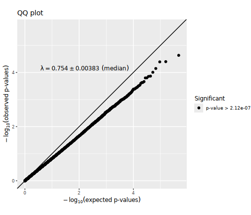
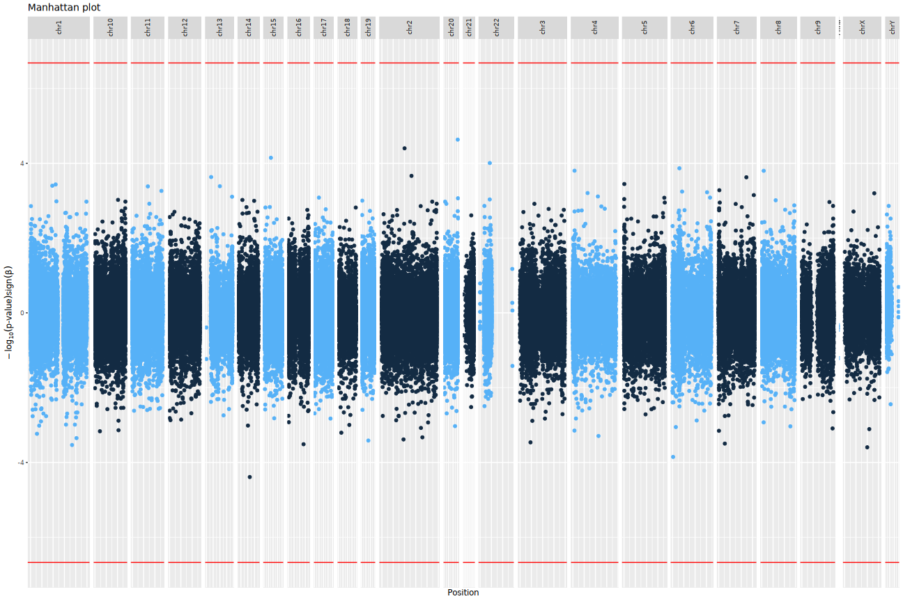

# Genome-wide methylation analysis report
- study: Pleural cfDNAm analysis of epithelioid_other_meso.platevariable
- author: Paul Yousefi
- date: 29 September, 2026

## Parameters


```
## $sig.threshold
## [1] 2.121323e-07
## 
## $max.plots
## [1] 10
## 
## $qq.inflation.method
## [1] "median"
## 
## $practical.threshold
## [1] 9.877832e-05
```

1/2                   
2/2 [unnamed-chunk-23]


## Sample characteristics

For continuous or ordinal variables, the "mean" column provides the mean
and the "sd/%" column the standard deviation of the variable.
For categorical variables, the "mean" column provides the number
of samples with the given "value" and the
"sd/%" column the percentage of samples with the given "value".


|variable               |value |mean          |sd..      |
|:----------------------|:-----|:-------------|:---------|
|epithelioid_other_meso |      |0.704918      |0.4598646 |
|plate                  |      |2.262295      |1.06304   |
|sv1                    |      |-9.721605e-18 |0.1290994 |
|sv2                    |      |-4.127966e-18 |0.1290994 |
|sv3                    |      |3.812481e-19  |0.1290994 |
|sv4                    |      |1.318272e-17  |0.1290994 |
|sv5                    |      |2.63119e-18   |0.1290994 |
|sv6                    |      |-2.77067e-17  |0.1290994 |
|sv7                    |      |1.020339e-17  |0.1290994 |
|sv8                    |      |3.048979e-16  |0.1290994 |
|sv9                    |      |2.582386e-13  |0.1290994 |
|sv10                   |      |2.149329e-13  |0.1290994 |


1/4                   
2/4 [unnamed-chunk-27]
3/4                   
4/4 [unnamed-chunk-28]


## Covariate associations


### Covariate plate


statistics


|var1                   |var2  |         F|   p-value|          R|   p-value|
|:----------------------|:-----|---------:|---------:|----------:|---------:|
|epithelioid_other_meso |plate | 0.7465368| 0.3910741| -0.1229721| 0.3450861|


### Covariate sv1


statistics


|var1                   |var2 |        F|   p-value|          R|   p-value|
|:----------------------|:----|--------:|---------:|----------:|---------:|
|epithelioid_other_meso |sv1  | 3.119894| 0.0825148| -0.1449463| 0.2650456|


### Covariate sv2


statistics


|var1                   |var2 |         F|   p-value|         R|   p-value|
|:----------------------|:----|---------:|---------:|---------:|---------:|
|epithelioid_other_meso |sv2  | 0.1539077| 0.6962423| 0.0551204| 0.6730842|


### Covariate sv3


statistics


|var1                   |var2 |         F|   p-value|          R|   p-value|
|:----------------------|:----|---------:|---------:|----------:|---------:|
|epithelioid_other_meso |sv3  | 0.9773108| 0.3269007| -0.1102408| 0.3976766|


### Covariate sv4


statistics


|var1                   |var2 |         F|   p-value|        R|   p-value|
|:----------------------|:----|---------:|---------:|--------:|---------:|
|epithelioid_other_meso |sv4  | 0.2593023| 0.6124992| 0.012249| 0.9253539|


### Covariate sv5


statistics


|var1                   |var2 |         F|   p-value|         R|   p-value|
|:----------------------|:----|---------:|---------:|---------:|---------:|
|epithelioid_other_meso |sv5  | 0.2857343| 0.5949759| 0.0265395| 0.8391137|


### Covariate sv6


statistics


|var1                   |var2 |        F|   p-value|          R|   p-value|
|:----------------------|:----|--------:|---------:|----------:|---------:|
|epithelioid_other_meso |sv6  | 0.002562| 0.9598022| -0.0796184| 0.5418987|


### Covariate sv7


statistics


|var1                   |var2 |         F|   p-value|          R|   p-value|
|:----------------------|:----|---------:|---------:|----------:|---------:|
|epithelioid_other_meso |sv7  | 0.8397151| 0.3632088| -0.1041163| 0.4245657|


### Covariate sv8


statistics


|var1                   |var2 |        F|   p-value|          R|   p-value|
|:----------------------|:----|--------:|---------:|----------:|---------:|
|epithelioid_other_meso |sv8  | 1.143249| 0.2893218| -0.0837014| 0.5213075|


### Covariate sv9


statistics


|var1                   |var2 |        F|  p-value|          R|   p-value|
|:----------------------|:----|--------:|--------:|----------:|---------:|
|epithelioid_other_meso |sv9  | 2.504221| 0.118888| -0.1061578| 0.4154897|


### Covariate sv10


statistics


|var1                   |var2 |         F|   p-value|         R|   p-value|
|:----------------------|:----|---------:|---------:|---------:|---------:|
|epithelioid_other_meso |sv10 | 0.6577561| 0.4206129| 0.1653612| 0.2028114|


## QQ plots




## Manhattan plots




## Significant CpG sites

There were 0
CpG sites with association p-values < 2.1213227 &times; 10<sup>-7</sup>.
These are listed in the file [associations.csv](associations.csv).


Below are the 10
CpG sites with association p-values < 9.8778317 &times; 10<sup>-5</sup>
in the  regression model.


|           |chromosome |  position|   estimate|  p.value| p.adjust|
|:----------|:----------|---------:|----------:|--------:|--------:|
|cg19689672 |chr12      |  96001921|  0.0563948| 2.77e-05| 1.000000|
|cg24082638 |chr19      |   9666638|  0.0727657| 2.60e-06| 0.615194|
|cg17882544 |chr1       |   2730824|  0.0854184| 9.14e-05| 1.000000|
|cg11347156 |chr7       |  86684183|  0.0810763| 1.27e-05| 1.000000|
|cg26921603 |chrX       |  38739404| -0.1700276| 7.98e-05| 1.000000|
|cg16506032 |chr11      |  66749879| -0.1062157| 2.63e-05| 1.000000|
|cg21644130 |chr3       | 139655800|  0.1379862| 3.66e-05| 1.000000|
|cg13927088 |chr1       | 152691125|  0.0798520| 5.74e-05| 1.000000|
|cg19698309 |chr11      |   2464959|  0.0858110| 8.98e-05| 1.000000|
|cg07784042 |chr2       |  67893948|  0.1316928| 1.97e-05| 1.000000|

Plots of these sites follow, one for each covariate set.
"p[lm]" denotes the p-value obtained using a linear model
and "p[beta]" the p-value obtained using beta regression.


## Selected CpG sites

Number of CpG sites selected: 0.


|chromosome | position| estimate| p.value| p.adjust|
|:----------|--------:|--------:|-------:|--------:|


## R session information


```
## R version 4.4.2 (2024-10-31)
## Platform: x86_64-conda-linux-gnu
## Running under: Red Hat Enterprise Linux 8.10 (Ootpa)
## 
## Matrix products: default
## BLAS/LAPACK: /home/py16069/miniforge3/envs/r442/lib/libopenblasp-r0.3.28.so;  LAPACK version 3.12.0
## 
## locale:
##  [1] LC_CTYPE=C.UTF-8       LC_NUMERIC=C           LC_TIME=C.UTF-8       
##  [4] LC_COLLATE=C.UTF-8     LC_MONETARY=C.UTF-8    LC_MESSAGES=C.UTF-8   
##  [7] LC_PAPER=C.UTF-8       LC_NAME=C              LC_ADDRESS=C          
## [10] LC_TELEPHONE=C         LC_MEASUREMENT=C.UTF-8 LC_IDENTIFICATION=C   
## 
## time zone: Europe/London
## tzcode source: system (glibc)
## 
## attached base packages:
## [1] parallel  stats     graphics  grDevices utils     datasets  methods  
## [8] base     
## 
## other attached packages:
##  [1] gridExtra_2.3       Cairo_1.6-2         dplyr_1.1.4        
##  [4] purrr_1.0.2         ewaff_0.0.2         metafor_4.6-0      
##  [7] numDeriv_2016.8-1.1 metadat_1.2-0       Matrix_1.6-5       
## [10] mice_3.17.0         survival_3.8-3      sandwich_3.1-1     
## [13] lmtest_0.9-40       zoo_1.8-12          MASS_7.3-60.0.1    
## [16] limma_3.62.1        markdown_1.13       knitr_1.49         
## [19] SmartSVA_0.1.3      RSpectra_0.16-2     isva_1.9           
## [22] JADE_2.0-4          fastICA_1.2-7       qvalue_2.38.0      
## [25] sva_3.54.0          BiocParallel_1.40.0 genefilter_1.88.0  
## [28] mgcv_1.9-1          nlme_3.1-165        ggplot2_4.0.3      
## [31] eval.save_1.0.0    
## 
## loaded via a namespace (and not attached):
##  [1] DBI_1.2.3               rlang_1.1.4             magrittr_2.0.3         
##  [4] clue_0.3-66             matrixStats_1.5.0       compiler_4.4.2         
##  [7] RSQLite_2.3.9           png_0.1-8               vctrs_0.6.5            
## [10] reshape2_1.4.4          stringr_1.5.1           pkgconfig_2.0.3        
## [13] shape_1.4.6.1           crayon_1.5.3            fastmap_1.2.0          
## [16] backports_1.5.0         XVector_0.46.0          labeling_0.4.3         
## [19] tzdb_0.4.0              nloptr_2.1.1            UCSC.utils_1.2.0       
## [22] bit_4.5.0.1             xfun_0.52               glmnet_4.1-8           
## [25] jomo_2.7-6              zlibbioc_1.52.0         cachem_1.1.0           
## [28] GenomeInfoDb_1.42.0     jsonlite_1.8.9          blob_1.2.4             
## [31] pan_1.9                 broom_1.0.7             cluster_2.1.8          
## [34] R6_2.5.1                stringi_1.8.4           RColorBrewer_1.1-3     
## [37] rpart_4.1.24            boot_1.3-31             Rcpp_1.0.13-1          
## [40] iterators_1.0.14        readr_2.1.5             IRanges_2.40.0         
## [43] nnet_7.3-20             splines_4.4.2           tidyselect_1.2.1       
## [46] yaml_2.3.10             codetools_0.2-20        lattice_0.22-6         
## [49] tibble_3.2.1            plyr_1.8.9              Biobase_2.66.0         
## [52] withr_3.0.2             KEGGREST_1.46.0         S7_0.2.0               
## [55] evaluate_1.0.1          Biostrings_2.74.0       pillar_1.10.1          
## [58] MatrixGenerics_1.18.0   foreach_1.5.2           stats4_4.4.2           
## [61] generics_0.1.3          mathjaxr_1.6-0          hms_1.1.3              
## [64] S4Vectors_0.44.0        commonmark_1.9.5        scales_1.4.0           
## [67] minqa_1.2.8             xtable_1.8-4            glue_1.8.0             
## [70] tools_4.4.2             lme4_1.1-35.5           annotate_1.84.0        
## [73] locfit_1.5-9.10         XML_3.99-0.17           grid_4.4.2             
## [76] tidyr_1.3.1             AnnotationDbi_1.68.0    edgeR_4.4.0            
## [79] GenomeInfoDbData_1.2.13 cli_3.6.3               config_0.3.2           
## [82] gtable_0.3.6            BiocGenerics_0.52.0     farver_2.1.2           
## [85] memoise_2.0.1           lifecycle_1.0.4         httr_1.4.7             
## [88] mime_0.12               mitml_0.4-5             statmod_1.5.0          
## [91] bit64_4.5.2
```
