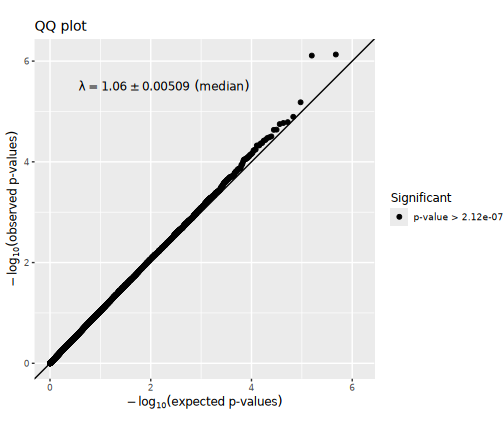
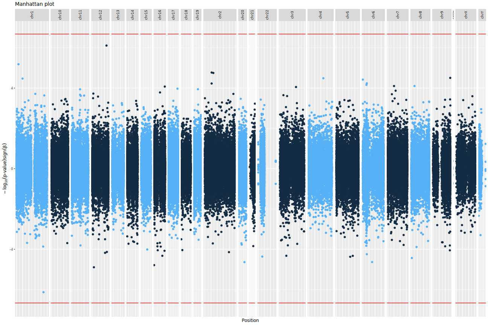
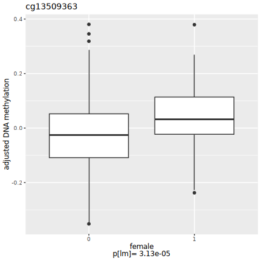
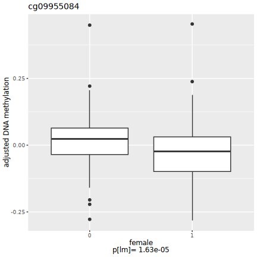
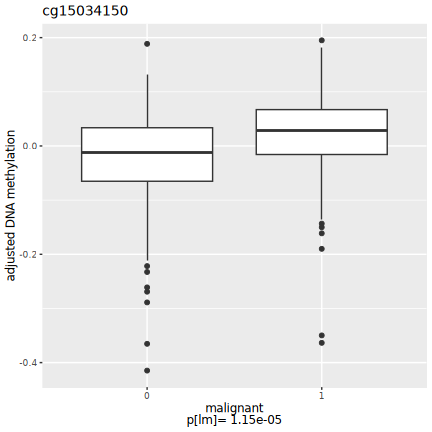
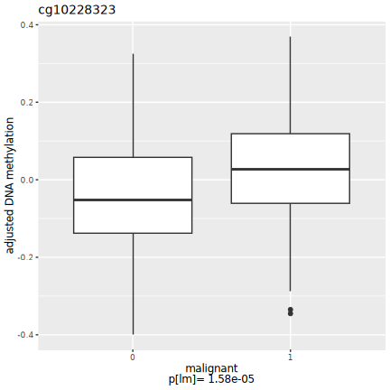
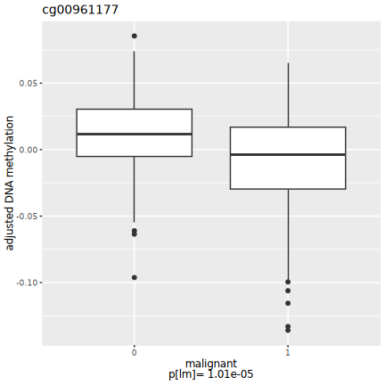

# Genome-wide methylation analysis report
- study: Pleural cfDNAm analysis of femalevariable
- author: Paul Yousefi
- date: 19 June, 2026

## Parameters


```
## $sig.threshold
## [1] 2.117738e-07
## 
## $max.plots
## [1] 10
## 
## $qq.inflation.method
## [1] "median"
## 
## $practical.threshold
## [1] 3.260762e-05
```

1/2                   
2/2 [unnamed-chunk-23]


## Sample characteristics

For continuous or ordinal variables, the "mean" column provides the mean
and the "sd/%" column the standard deviation of the variable.
For categorical variables, the "mean" column provides the number
of samples with the given "value" and the
"sd/%" column the percentage of samples with the given "value".


|variable |value |mean          |sd..       |
|:--------|:-----|:-------------|:----------|
|female   |      |0.3506494     |0.4779498  |
|sv1      |      |1.181886e-19  |0.05707301 |
|sv2      |      |-5.074343e-18 |0.05707301 |
|sv3      |      |5.069503e-18  |0.05707301 |
|sv4      |      |-2.06369e-17  |0.05707301 |
|sv5      |      |3.38772e-17   |0.05707301 |
|sv6      |      |6.800399e-18  |0.05707301 |
|sv7      |      |1.172016e-17  |0.05707301 |
|sv8      |      |1.199669e-17  |0.05707301 |
|sv9      |      |-3.856838e-18 |0.05707301 |
|sv10     |      |-5.749132e-18 |0.05707301 |
|sv11     |      |5.474913e-20  |0.05707301 |
|sv12     |      |1.901766e-17  |0.05707301 |
|sv13     |      |-1.308897e-18 |0.05707301 |
|sv14     |      |-1.799312e-18 |0.05707301 |
|sv15     |      |-7.06419e-18  |0.05707301 |
|sv16     |      |-6.053307e-18 |0.05707301 |
|sv17     |      |3.07825e-18   |0.05707301 |
|sv18     |      |-2.241964e-18 |0.05707301 |
|sv19     |      |-1.481939e-18 |0.05707301 |
|sv20     |      |8.117227e-18  |0.05707301 |
|sv21     |      |-4.133658e-19 |0.05707301 |
|sv22     |      |2.435352e-18  |0.05707301 |
|sv23     |      |-9.019427e-18 |0.05707301 |
|sv24     |      |1.726066e-18  |0.05707301 |
|sv25     |      |-1.392412e-18 |0.05707301 |
|sv26     |      |1.402841e-18  |0.05707301 |
|sv27     |      |5.069792e-18  |0.05707301 |
|sv28     |      |5.796164e-18  |0.05707301 |
|sv29     |      |-9.115967e-18 |0.05707301 |
|sv30     |      |-1.061403e-17 |0.05707301 |


1/4                   
2/4 [unnamed-chunk-27]
3/4                   
4/4 [unnamed-chunk-28]


## Covariate associations


### Covariate sv1


statistics


|var1   |var2 |        F|   p-value|          R|   p-value|
|:------|:----|--------:|---------:|----------:|---------:|
|female |sv1  | 1.341395| 0.2476912| -0.0700988| 0.2199215|


### Covariate sv2


statistics


|var1   |var2 |        F|   p-value|        R|   p-value|
|:------|:----|--------:|---------:|--------:|---------:|
|female |sv2  | 2.277958| 0.1322564| 0.101628| 0.0749246|


### Covariate sv3


statistics


|var1   |var2 |        F|   p-value|         R|   p-value|
|:------|:----|--------:|---------:|---------:|---------:|
|female |sv3  | 1.489247| 0.2232729| 0.0844094| 0.1394092|


### Covariate sv4


statistics


|var1   |var2 |        F|   p-value|         R|   p-value|
|:------|:----|--------:|---------:|---------:|---------:|
|female |sv4  | 0.405977| 0.5244949| -0.011173| 0.8451632|


### Covariate sv5


statistics


|var1   |var2 |        F|   p-value|         R|   p-value|
|:------|:----|--------:|---------:|---------:|---------:|
|female |sv5  | 4.408039| 0.0365887| 0.1221373| 0.0321281|


### Covariate sv6


statistics


|var1   |var2 |         F|   p-value|          R|   p-value|
|:------|:----|---------:|---------:|----------:|---------:|
|female |sv6  | 0.0005833| 0.9807476| -0.0231877| 0.6852257|


### Covariate sv7


statistics


|var1   |var2 |        F|   p-value|         R|   p-value|
|:------|:----|--------:|---------:|---------:|---------:|
|female |sv7  | 1.801695| 0.1805027| 0.0739252| 0.1957077|


### Covariate sv8


statistics


|var1   |var2 |        F|   p-value|          R|   p-value|
|:------|:----|--------:|---------:|----------:|---------:|
|female |sv8  | 0.699865| 0.4034819| -0.0477529| 0.4036449|


### Covariate sv9


statistics


|var1   |var2 |        F|   p-value|         R|   p-value|
|:------|:----|--------:|---------:|---------:|---------:|
|female |sv9  | 1.138637| 0.2867816| 0.0990261| 0.0827229|


### Covariate sv10


statistics


|var1   |var2 |        F|  p-value|         R|   p-value|
|:------|:----|--------:|--------:|---------:|---------:|
|female |sv10 | 1.578231| 0.209974| 0.0816544| 0.1528345|


### Covariate sv11


statistics


|var1   |var2 |         F|  p-value|          R|   p-value|
|:------|:----|---------:|--------:|----------:|---------:|
|female |sv11 | 0.1675699| 0.682567| -0.0322944| 0.5723405|


### Covariate sv12


statistics


|var1   |var2 |         F|   p-value|          R|   p-value|
|:------|:----|---------:|---------:|----------:|---------:|
|female |sv12 | 0.7110024| 0.3997699| -0.0441561| 0.4400179|


### Covariate sv13


statistics


|var1   |var2 |         F|   p-value|          R|  p-value|
|:------|:----|---------:|---------:|----------:|--------:|
|female |sv13 | 0.9803663| 0.3228907| -0.0443092| 0.438433|


### Covariate sv14


statistics


|var1   |var2 |        F|   p-value|         R|   p-value|
|:------|:----|--------:|---------:|---------:|---------:|
|female |sv14 | 3.135371| 0.0776065| 0.0633644| 0.2675879|


### Covariate sv15


statistics


|var1   |var2 |        F|   p-value|         R|   p-value|
|:------|:----|--------:|---------:|---------:|---------:|
|female |sv15 | 2.179599| 0.1408792| 0.1033116| 0.0702049|


### Covariate sv16


statistics


|var1   |var2 |         F|   p-value|          R|   p-value|
|:------|:----|---------:|---------:|----------:|---------:|
|female |sv16 | 0.0435445| 0.8348422| -0.0372687| 0.5146398|


### Covariate sv17


statistics


|var1   |var2 |        F|   p-value|          R|   p-value|
|:------|:----|--------:|---------:|----------:|---------:|
|female |sv17 | 2.044289| 0.1537985| -0.0487478| 0.3939099|


### Covariate sv18


statistics


|var1   |var2 |        F|   p-value|          R|   p-value|
|:------|:----|--------:|---------:|----------:|---------:|
|female |sv18 | 1.447438| 0.2298695| -0.0351259| 0.5391223|


### Covariate sv19


statistics


|var1   |var2 |         F|  p-value|          R|  p-value|
|:------|:----|---------:|--------:|----------:|--------:|
|female |sv19 | 0.0581187| 0.809656| -0.0378809| 0.507752|


### Covariate sv20


statistics


|var1   |var2 |        F|   p-value|         R|  p-value|
|:------|:----|--------:|---------:|---------:|--------:|
|female |sv20 | 0.921548| 0.3378268| 0.0092598| 0.871423|


### Covariate sv21


statistics


|var1   |var2 |        F|   p-value|          R|   p-value|
|:------|:----|--------:|---------:|----------:|---------:|
|female |sv21 | 3.266432| 0.0716932| -0.1010158| 0.0767035|


### Covariate sv22


statistics


|var1   |var2 |         F|   p-value|         R|   p-value|
|:------|:----|---------:|---------:|---------:|---------:|
|female |sv22 | 0.0516006| 0.8204529| 0.0524211| 0.3592077|


### Covariate sv23


statistics


|var1   |var2 |        F|   p-value|          R|   p-value|
|:------|:----|--------:|---------:|----------:|---------:|
|female |sv23 | 1.544558| 0.2148921| -0.1330041| 0.0195379|


### Covariate sv24


statistics


|var1   |var2 |        F|   p-value|         R|   p-value|
|:------|:----|--------:|---------:|---------:|---------:|
|female |sv24 | 1.226525| 0.2689537| 0.0195144| 0.7330159|


### Covariate sv25


statistics


|var1   |var2 |         F|   p-value|         R|   p-value|
|:------|:----|---------:|---------:|---------:|---------:|
|female |sv25 | 0.3266827| 0.5680386| 0.0961946| 0.0919396|


### Covariate sv26


statistics


|var1   |var2 |         F|   p-value|         R|   p-value|
|:------|:----|---------:|---------:|---------:|---------:|
|female |sv26 | 0.0566761| 0.8119881| 0.0487478| 0.3939099|


### Covariate sv27


statistics


|var1   |var2 |         F|   p-value|          R|   p-value|
|:------|:----|---------:|---------:|----------:|---------:|
|female |sv27 | 0.6342484| 0.4264187| -0.0218102| 0.7030126|


### Covariate sv28


statistics


|var1   |var2 |        F|  p-value|         R|   p-value|
|:------|:----|--------:|--------:|---------:|---------:|
|female |sv28 | 1.011125| 0.315428| -0.002755| 0.9615942|


### Covariate sv29


statistics


|var1   |var2 |         F|   p-value|          R|   p-value|
|:------|:----|---------:|---------:|----------:|---------:|
|female |sv29 | 0.0218782| 0.8825089| -0.0665021| 0.2445661|


### Covariate sv30


statistics


|var1   |var2 |         F|   p-value|          R|  p-value|
|:------|:----|---------:|---------:|----------:|--------:|
|female |sv30 | 0.1987744| 0.6560272| -0.0082649| 0.885136|


## QQ plots




## Manhattan plots




## Significant CpG sites

There were 0
CpG sites with association p-values < 2.1177377 &times; 10<sup>-7</sup>.
These are listed in the file [associations.csv](associations.csv).


Below are the 10
CpG sites with association p-values < 3.2607624 &times; 10<sup>-5</sup>
in the  regression model.


|           |chromosome |  position|   estimate|  p.value|  p.adjust|
|:----------|:----------|---------:|----------:|--------:|---------:|
|cg02949690 |chr2       |  68994845|  0.0543228| 1.78e-05| 1.0000000|
|cg13509363 |chr9       | 139739661|  0.0683267| 3.13e-05| 1.0000000|
|cg09955084 |chr16      |    413813| -0.0556524| 1.63e-05| 1.0000000|
|cg09719324 |chr6       |  76059791| -0.0727490| 2.32e-05| 1.0000000|
|cg00282828 |chr1       |  15740602|  0.0313045| 6.60e-06| 1.0000000|
|cg02837956 |chr2       |  55237355|  0.0403836| 1.69e-05| 1.0000000|
|cg25357241 |chr20      |  47579237| -0.0562611| 2.30e-05| 1.0000000|
|cg09090941 |chr12      | 117319914|  0.0459567| 8.00e-07| 0.1835964|
|cg03922963 |chr12      |  14948183| -0.0516759| 1.28e-05| 1.0000000|
|cg06811732 |chr1       | 219749669| -0.0516953| 7.00e-07| 0.1747309|

Plots of these sites follow, one for each covariate set.
"p[lm]" denotes the p-value obtained using a linear model
and "p[beta]" the p-value obtained using beta regression.

















## Selected CpG sites

Number of CpG sites selected: 0.


|chromosome | position| estimate| p.value| p.adjust|
|:----------|--------:|--------:|-------:|--------:|


## R session information


```
## R version 4.4.2 (2024-10-31)
## Platform: x86_64-conda-linux-gnu
## Running under: Red Hat Enterprise Linux 8.10 (Ootpa)
## 
## Matrix products: default
## BLAS/LAPACK: /home/py16069/miniforge3/envs/r442/lib/libopenblasp-r0.3.28.so;  LAPACK version 3.12.0
## 
## locale:
##  [1] LC_CTYPE=C.UTF-8       LC_NUMERIC=C           LC_TIME=C.UTF-8       
##  [4] LC_COLLATE=C.UTF-8     LC_MONETARY=C.UTF-8    LC_MESSAGES=C.UTF-8   
##  [7] LC_PAPER=C.UTF-8       LC_NAME=C              LC_ADDRESS=C          
## [10] LC_TELEPHONE=C         LC_MEASUREMENT=C.UTF-8 LC_IDENTIFICATION=C   
## 
## time zone: Europe/London
## tzcode source: system (glibc)
## 
## attached base packages:
## [1] parallel  stats     graphics  grDevices utils     datasets  methods  
## [8] base     
## 
## other attached packages:
##  [1] gridExtra_2.3       Cairo_1.6-2         dplyr_1.1.4        
##  [4] purrr_1.0.2         ewaff_0.0.2         metafor_4.6-0      
##  [7] numDeriv_2016.8-1.1 metadat_1.2-0       Matrix_1.6-5       
## [10] mice_3.17.0         survival_3.8-3      sandwich_3.1-1     
## [13] lmtest_0.9-40       zoo_1.8-12          MASS_7.3-60.0.1    
## [16] limma_3.62.1        markdown_1.13       knitr_1.49         
## [19] SmartSVA_0.1.3      RSpectra_0.16-2     isva_1.9           
## [22] JADE_2.0-4          fastICA_1.2-7       qvalue_2.38.0      
## [25] sva_3.54.0          BiocParallel_1.40.0 genefilter_1.88.0  
## [28] mgcv_1.9-1          nlme_3.1-165        ggplot2_3.5.1      
## [31] eval.save_1.0.0    
## 
## loaded via a namespace (and not attached):
##  [1] DBI_1.2.3               rlang_1.1.4             magrittr_2.0.3         
##  [4] clue_0.3-66             matrixStats_1.5.0       compiler_4.4.2         
##  [7] RSQLite_2.3.9           png_0.1-8               vctrs_0.6.5            
## [10] reshape2_1.4.4          stringr_1.5.1           pkgconfig_2.0.3        
## [13] shape_1.4.6.1           crayon_1.5.3            fastmap_1.2.0          
## [16] backports_1.5.0         XVector_0.46.0          labeling_0.4.3         
## [19] tzdb_0.4.0              nloptr_2.1.1            UCSC.utils_1.2.0       
## [22] bit_4.5.0.1             xfun_0.52               glmnet_4.1-8           
## [25] jomo_2.7-6              zlibbioc_1.52.0         cachem_1.1.0           
## [28] GenomeInfoDb_1.42.0     jsonlite_1.8.9          blob_1.2.4             
## [31] pan_1.9                 broom_1.0.7             cluster_2.1.8          
## [34] R6_2.5.1                stringi_1.8.4           rpart_4.1.24           
## [37] boot_1.3-31             Rcpp_1.0.13-1           iterators_1.0.14       
## [40] readr_2.1.5             IRanges_2.40.0          nnet_7.3-20            
## [43] splines_4.4.2           tidyselect_1.2.1        yaml_2.3.10            
## [46] codetools_0.2-20        lattice_0.22-6          tibble_3.2.1           
## [49] plyr_1.8.9              Biobase_2.66.0          withr_3.0.2            
## [52] KEGGREST_1.46.0         evaluate_1.0.1          Biostrings_2.74.0      
## [55] pillar_1.10.1           MatrixGenerics_1.18.0   foreach_1.5.2          
## [58] stats4_4.4.2            generics_0.1.3          mathjaxr_1.6-0         
## [61] hms_1.1.3               S4Vectors_0.44.0        commonmark_1.9.5       
## [64] munsell_0.5.1           scales_1.3.0            minqa_1.2.8            
## [67] xtable_1.8-4            glue_1.8.0              tools_4.4.2            
## [70] lme4_1.1-35.5           annotate_1.84.0         locfit_1.5-9.10        
## [73] XML_3.99-0.17           grid_4.4.2              tidyr_1.3.1            
## [76] AnnotationDbi_1.68.0    edgeR_4.4.0             colorspace_2.1-1       
## [79] GenomeInfoDbData_1.2.13 meffil_1.6.0            cli_3.6.3              
## [82] config_0.3.2            gtable_0.3.6            BiocGenerics_0.52.0    
## [85] farver_2.1.2            memoise_2.0.1           lifecycle_1.0.4        
## [88] httr_1.4.7              mime_0.12               mitml_0.4-5            
## [91] statmod_1.5.0           bit64_4.5.2
```
