# Genome-wide methylation analysis report
- study: Pleural cfDNAm analysis of female.platevariable
- author: Paul Yousefi
- date: 17 September, 2026

## Parameters


```
## $sig.threshold
## [1] 2.117738e-07
## 
## $max.plots
## [1] 10
## 
## $qq.inflation.method
## [1] "median"
## 
## $practical.threshold
## [1] 3.852505e-05
```

1/2                   
2/2 [unnamed-chunk-23]


## Sample characteristics

For continuous or ordinal variables, the "mean" column provides the mean
and the "sd/%" column the standard deviation of the variable.
For categorical variables, the "mean" column provides the number
of samples with the given "value" and the
"sd/%" column the percentage of samples with the given "value".


|variable |value |mean          |sd..      |
|:--------|:-----|:-------------|:---------|
|female   |      |0.3485342     |0.4772841 |
|plate    |      |2.312704      |1.050957  |
|sv1      |      |2.502582e-19  |0.0571662 |
|sv2      |      |-8.122687e-20 |0.0571662 |
|sv3      |      |-5.617677e-19 |0.0571662 |
|sv4      |      |-9.66219e-19  |0.0571662 |
|sv5      |      |-3.553896e-19 |0.0571662 |
|sv6      |      |1.806139e-18  |0.0571662 |
|sv7      |      |3.395071e-18  |0.0571662 |
|sv8      |      |1.248416e-18  |0.0571662 |
|sv9      |      |-4.475336e-18 |0.0571662 |
|sv10     |      |-7.033618e-18 |0.0571662 |
|sv11     |      |-1.541379e-18 |0.0571662 |
|sv12     |      |-1.726192e-18 |0.0571662 |
|sv13     |      |-8.485273e-18 |0.0571662 |
|sv14     |      |-3.281273e-19 |0.0571662 |
|sv15     |      |-4.076821e-18 |0.0571662 |
|sv16     |      |-1.056664e-17 |0.0571662 |
|sv17     |      |-6.718599e-18 |0.0571662 |
|sv18     |      |-8.489709e-18 |0.0571662 |
|sv19     |      |-3.181949e-17 |0.0571662 |
|sv20     |      |-6.461228e-16 |0.0571662 |


1/4                   
2/4 [unnamed-chunk-27]
3/4                   
4/4 [unnamed-chunk-28]


## Covariate associations


### Covariate plate


statistics


|var1   |var2  |        F|   p-value|          R|   p-value|
|:------|:-----|--------:|---------:|----------:|---------:|
|female |plate | 1.162792| 0.2817394| -0.0594902| 0.2987948|


### Covariate sv1


statistics


|var1   |var2 |        F|   p-value|         R|   p-value|
|:------|:----|--------:|---------:|---------:|---------:|
|female |sv1  | 1.366445| 0.2433365| 0.0685724| 0.2309189|


### Covariate sv2


statistics


|var1   |var2 |        F|   p-value|          R|   p-value|
|:------|:----|--------:|---------:|----------:|---------:|
|female |sv2  | 2.633404| 0.1056703| -0.1103021| 0.0535252|


### Covariate sv3


statistics


|var1   |var2 |        F|   p-value|          R|   p-value|
|:------|:----|--------:|---------:|----------:|---------:|
|female |sv3  | 1.401911| 0.2373258| -0.0734319| 0.1994519|


### Covariate sv4


statistics


|var1   |var2 |         F|   p-value|         R|   p-value|
|:------|:----|---------:|---------:|---------:|---------:|
|female |sv4  | 0.3470315| 0.5562344| 0.0124958| 0.8273833|


### Covariate sv5


statistics


|var1   |var2 |        F|   p-value|         R|   p-value|
|:------|:----|--------:|---------:|---------:|---------:|
|female |sv5  | 3.419839| 0.0653847| 0.1103021| 0.0535252|


### Covariate sv6


statistics


|var1   |var2 |         F|   p-value|         R|   p-value|
|:------|:----|---------:|---------:|---------:|---------:|
|female |sv6  | 0.0755555| 0.7835994| 0.0339391| 0.5535788|


### Covariate sv7


statistics


|var1   |var2 |        F|   p-value|         R|   p-value|
|:------|:----|--------:|---------:|---------:|---------:|
|female |sv7  | 1.350903| 0.2460289| 0.0633273| 0.2686539|


### Covariate sv8


statistics


|var1   |var2 |         F|   p-value|         R|   p-value|
|:------|:----|---------:|---------:|---------:|---------:|
|female |sv8  | 0.2955996| 0.5870515| -0.021829| 0.7032327|


### Covariate sv9


statistics


|var1   |var2 |        F|   p-value|         R|   p-value|
|:------|:----|--------:|---------:|---------:|---------:|
|female |sv9  | 2.653311| 0.1043669| 0.1109963| 0.0520299|


### Covariate sv10


statistics


|var1   |var2 |         F|   p-value|          R|   p-value|
|:------|:----|---------:|---------:|----------:|---------:|
|female |sv10 | 0.7521106| 0.3864906| -0.0599334| 0.2952034|


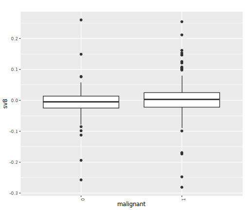


### Covariate sv11


statistics


|var1   |var2 |         F|   p-value|         R|   p-value|
|:------|:----|---------:|---------:|---------:|---------:|
|female |sv11 | 0.2414403| 0.6235212| 0.0311623| 0.5865022|


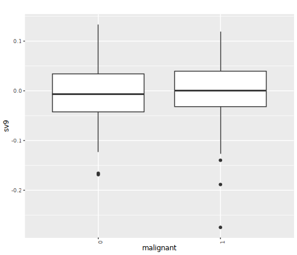


### Covariate sv12


statistics


|var1   |var2 |         F|   p-value|         R|  p-value|
|:------|:----|---------:|---------:|---------:|--------:|
|female |sv12 | 0.1071023| 0.7436921| -0.006865| 0.904646|


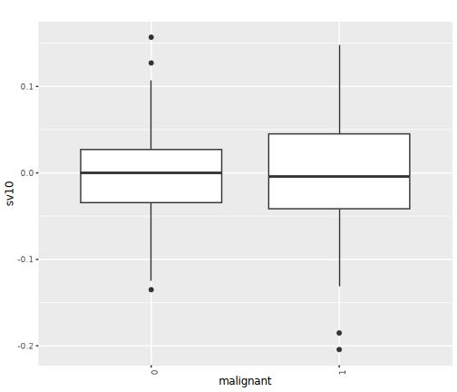


### Covariate sv13


statistics


|var1   |var2 |        F|   p-value|         R|   p-value|
|:------|:----|--------:|---------:|---------:|---------:|
|female |sv13 | 1.265257| 0.2615427| 0.0096418| 0.8663846|


### Covariate sv14


statistics


|var1   |var2 |        F|  p-value|          R|   p-value|
|:------|:----|--------:|--------:|----------:|---------:|
|female |sv14 | 2.879376| 0.090741| -0.0655642| 0.2520751|


### Covariate sv15


statistics


|var1   |var2 |        F|  p-value|         R|   p-value|
|:------|:----|--------:|--------:|---------:|---------:|
|female |sv15 | 3.738792| 0.054088| 0.1215637| 0.0332392|


### Covariate sv16


statistics


|var1   |var2 |         F|   p-value|          R|   p-value|
|:------|:----|---------:|---------:|----------:|---------:|
|female |sv16 | 0.6707623| 0.4134254| -0.0647928| 0.2577098|


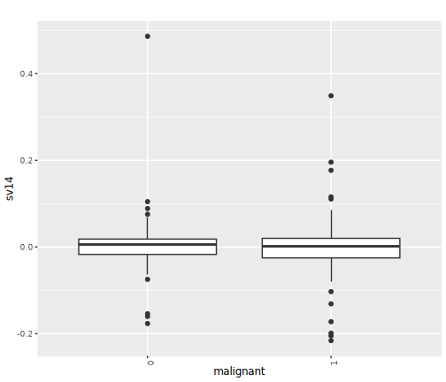


### Covariate sv17


statistics


|var1   |var2 |        F|   p-value|          R|   p-value|
|:------|:----|--------:|---------:|----------:|---------:|
|female |sv17 | 3.303382| 0.0701185| -0.0520657| 0.3632659|


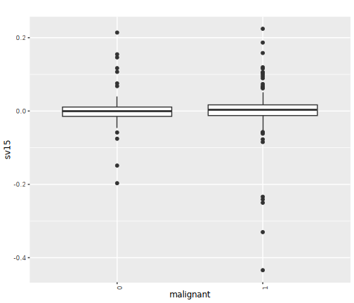


### Covariate sv18


statistics


|var1   |var2 |         F|   p-value|         R|  p-value|
|:------|:----|---------:|---------:|---------:|--------:|
|female |sv18 | 0.0006624| 0.9794838| 0.0232946| 0.684343|


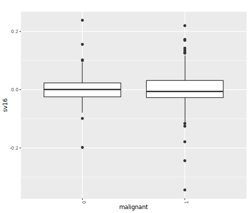


### Covariate sv19


statistics


|var1   |var2 |         F|   p-value|         R|   p-value|
|:------|:----|---------:|---------:|---------:|---------:|
|female |sv19 | 0.0463014| 0.8297727| 0.0745889| 0.1924423|


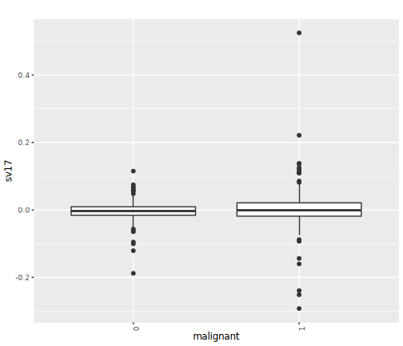


### Covariate sv20


statistics


|var1   |var2 |         F|   p-value|        R|   p-value|
|:------|:----|---------:|---------:|--------:|---------:|
|female |sv20 | 0.6414188| 0.4238209| 0.029311| 0.6089409|


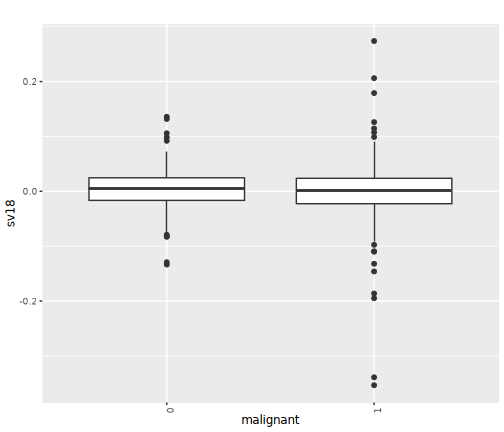


## QQ plots


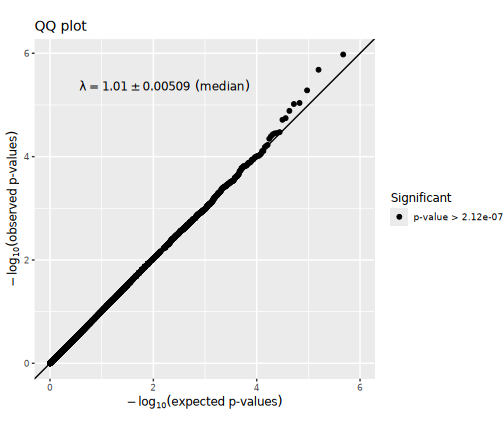

## Manhattan plots


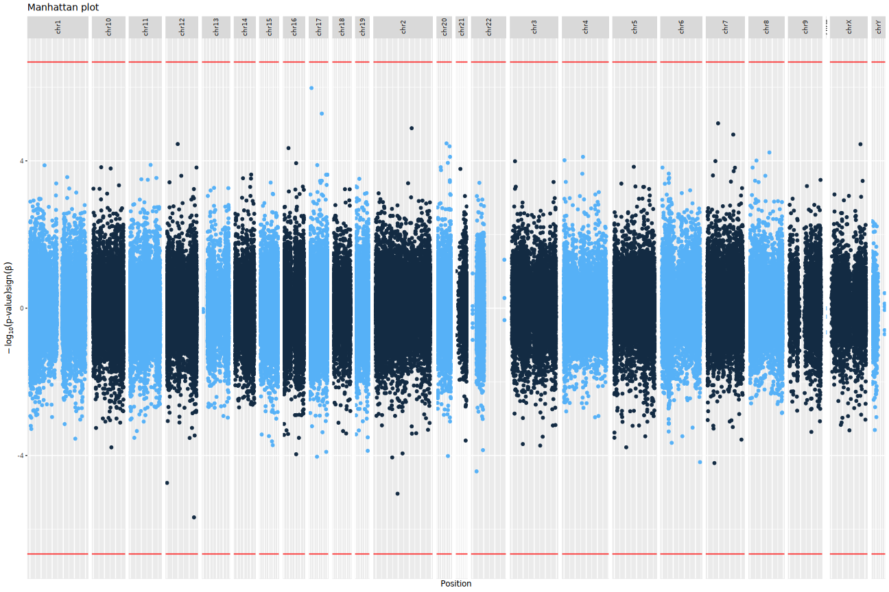

## Significant CpG sites

There were 0
CpG sites with association p-values < 2.1177377 &times; 10<sup>-7</sup>.
These are listed in the file [associations.csv](associations.csv).


Below are the 10
CpG sites with association p-values < 3.852505 &times; 10<sup>-5</sup>
in the  regression model.


|           |chromosome |  position|   estimate|  p.value|  p.adjust|
|:----------|:----------|---------:|----------:|--------:|---------:|
|cg09586804 |chr6       |  53140575| -0.0344677| 1.81e-05| 1.0000000|
|cg09719324 |chr6       |  76059791| -0.0759594| 7.90e-06| 1.0000000|
|cg23226544 |chr18      |   9143407| -0.0438198| 8.50e-06| 1.0000000|
|cg12333161 |chr8       |  26123664|  0.0589102| 3.00e-05| 1.0000000|
|cg03815999 |chr1       |  48689242|  0.0400684| 7.20e-06| 1.0000000|
|cg02471378 |chr6       |  32943025| -0.0615854| 5.90e-06| 1.0000000|
|cg26734335 |chr16      |  87166401|  0.0637180| 1.21e-05| 1.0000000|
|cg16118747 |chr22      |  32924527| -0.0390738| 2.34e-05| 1.0000000|
|cg09090941 |chr12      | 117319914|  0.0414519| 1.03e-05| 1.0000000|
|cg06811732 |chr1       | 219749669| -0.0515670| 1.10e-06| 0.2571811|

Plots of these sites follow, one for each covariate set.
"p[lm]" denotes the p-value obtained using a linear model
and "p[beta]" the p-value obtained using beta regression.


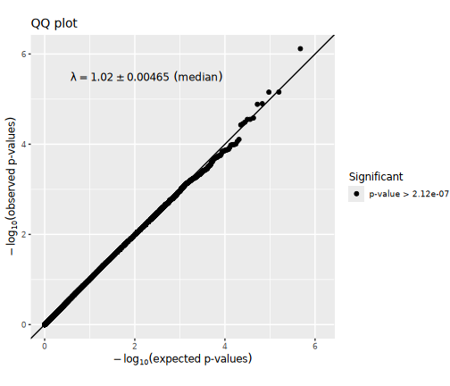


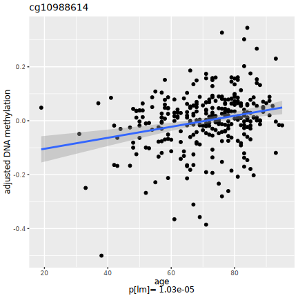


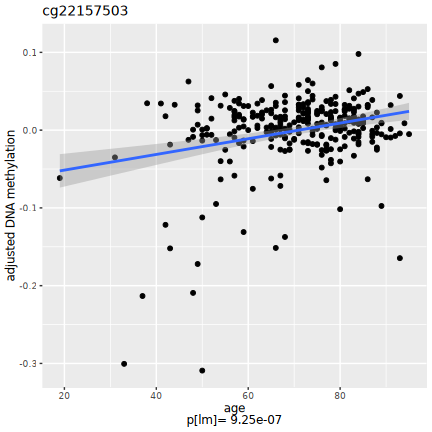


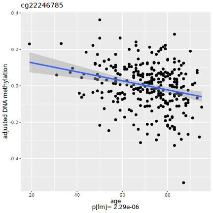


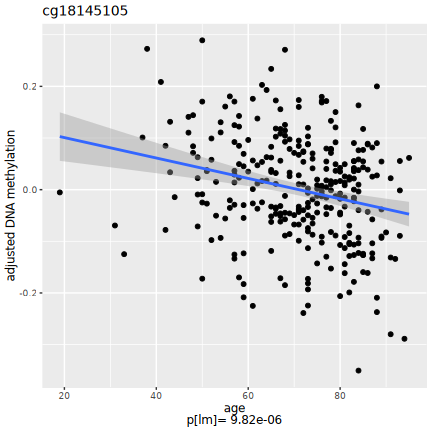


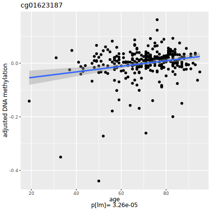


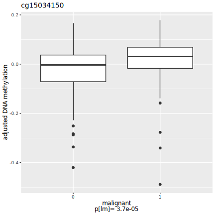


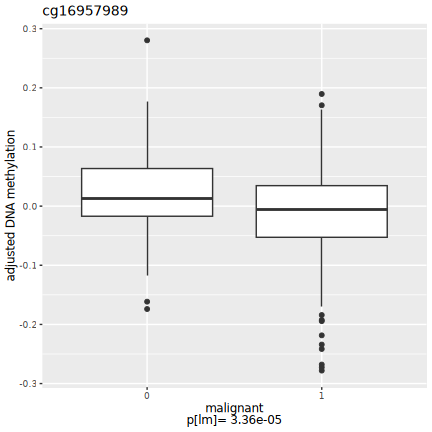


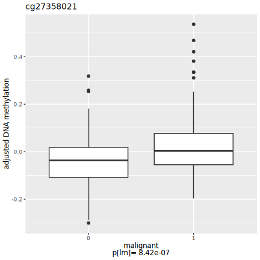


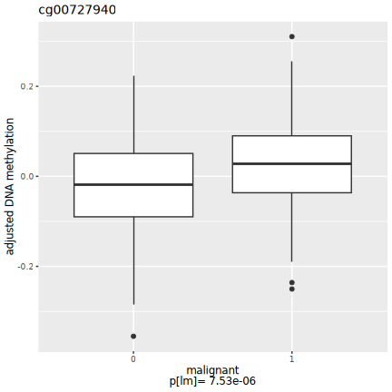

## Selected CpG sites

Number of CpG sites selected: 0.


|chromosome | position| estimate| p.value| p.adjust|
|:----------|--------:|--------:|-------:|--------:|


## R session information


```
## R version 4.4.2 (2024-10-31)
## Platform: x86_64-conda-linux-gnu
## Running under: Red Hat Enterprise Linux 8.10 (Ootpa)
## 
## Matrix products: default
## BLAS/LAPACK: /home/py16069/miniforge3/envs/r442/lib/libopenblasp-r0.3.28.so;  LAPACK version 3.12.0
## 
## locale:
##  [1] LC_CTYPE=C.UTF-8       LC_NUMERIC=C           LC_TIME=C.UTF-8       
##  [4] LC_COLLATE=C.UTF-8     LC_MONETARY=C.UTF-8    LC_MESSAGES=C.UTF-8   
##  [7] LC_PAPER=C.UTF-8       LC_NAME=C              LC_ADDRESS=C          
## [10] LC_TELEPHONE=C         LC_MEASUREMENT=C.UTF-8 LC_IDENTIFICATION=C   
## 
## time zone: Europe/London
## tzcode source: system (glibc)
## 
## attached base packages:
## [1] parallel  stats     graphics  grDevices utils     datasets  methods  
## [8] base     
## 
## other attached packages:
##  [1] gridExtra_2.3       Cairo_1.6-2         dplyr_1.1.4        
##  [4] purrr_1.0.2         ewaff_0.0.2         metafor_4.6-0      
##  [7] numDeriv_2016.8-1.1 metadat_1.2-0       Matrix_1.6-5       
## [10] mice_3.17.0         survival_3.8-3      sandwich_3.1-1     
## [13] lmtest_0.9-40       zoo_1.8-12          MASS_7.3-60.0.1    
## [16] limma_3.62.1        markdown_1.13       knitr_1.49         
## [19] SmartSVA_0.1.3      RSpectra_0.16-2     isva_1.9           
## [22] JADE_2.0-4          fastICA_1.2-7       qvalue_2.38.0      
## [25] sva_3.54.0          BiocParallel_1.40.0 genefilter_1.88.0  
## [28] mgcv_1.9-1          nlme_3.1-165        ggplot2_4.0.3      
## [31] eval.save_1.0.0    
## 
## loaded via a namespace (and not attached):
##  [1] DBI_1.2.3               rlang_1.1.4             magrittr_2.0.3         
##  [4] clue_0.3-66             matrixStats_1.5.0       compiler_4.4.2         
##  [7] RSQLite_2.3.9           png_0.1-8               vctrs_0.6.5            
## [10] reshape2_1.4.4          stringr_1.5.1           pkgconfig_2.0.3        
## [13] shape_1.4.6.1           crayon_1.5.3            fastmap_1.2.0          
## [16] backports_1.5.0         XVector_0.46.0          labeling_0.4.3         
## [19] tzdb_0.4.0              nloptr_2.1.1            UCSC.utils_1.2.0       
## [22] bit_4.5.0.1             xfun_0.52               glmnet_4.1-8           
## [25] jomo_2.7-6              zlibbioc_1.52.0         cachem_1.1.0           
## [28] GenomeInfoDb_1.42.0     jsonlite_1.8.9          blob_1.2.4             
## [31] pan_1.9                 broom_1.0.7             cluster_2.1.8          
## [34] R6_2.5.1                stringi_1.8.4           RColorBrewer_1.1-3     
## [37] rpart_4.1.24            boot_1.3-31             Rcpp_1.0.13-1          
## [40] iterators_1.0.14        readr_2.1.5             IRanges_2.40.0         
## [43] nnet_7.3-20             splines_4.4.2           tidyselect_1.2.1       
## [46] yaml_2.3.10             codetools_0.2-20        lattice_0.22-6         
## [49] tibble_3.2.1            plyr_1.8.9              Biobase_2.66.0         
## [52] withr_3.0.2             KEGGREST_1.46.0         S7_0.2.0               
## [55] evaluate_1.0.1          Biostrings_2.74.0       pillar_1.10.1          
## [58] MatrixGenerics_1.18.0   foreach_1.5.2           stats4_4.4.2           
## [61] generics_0.1.3          mathjaxr_1.6-0          hms_1.1.3              
## [64] S4Vectors_0.44.0        commonmark_1.9.5        scales_1.4.0           
## [67] minqa_1.2.8             xtable_1.8-4            glue_1.8.0             
## [70] tools_4.4.2             lme4_1.1-35.5           annotate_1.84.0        
## [73] locfit_1.5-9.10         XML_3.99-0.17           grid_4.4.2             
## [76] tidyr_1.3.1             AnnotationDbi_1.68.0    edgeR_4.4.0            
## [79] GenomeInfoDbData_1.2.13 cli_3.6.3               config_0.3.2           
## [82] gtable_0.3.6            BiocGenerics_0.52.0     farver_2.1.2           
## [85] memoise_2.0.1           lifecycle_1.0.4         httr_1.4.7             
## [88] mime_0.12               mitml_0.4-5             statmod_1.5.0          
## [91] bit64_4.5.2
```
