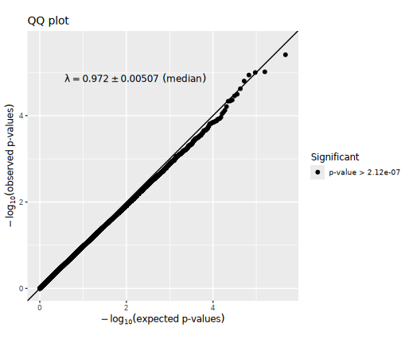
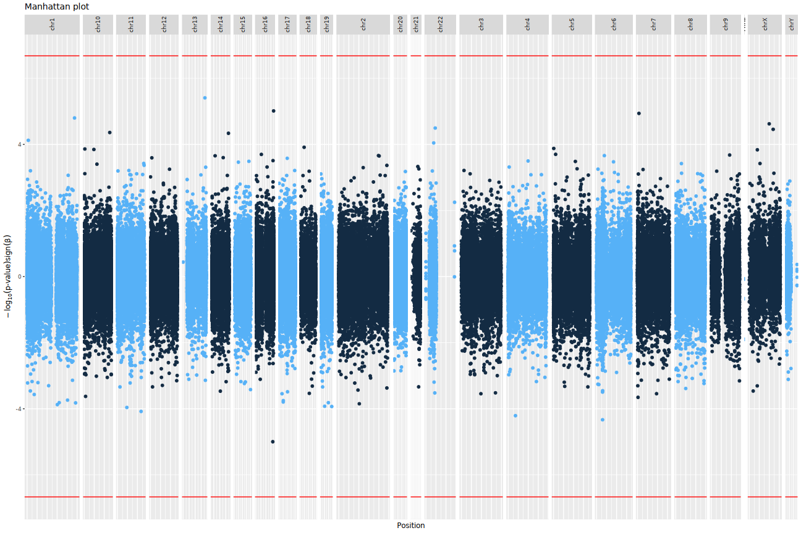

# Genome-wide methylation analysis report
- study: Pleural cfDNAm analysis of malignant.fulladjvariable
- author: Paul Yousefi
- date: 19 June, 2026

## Parameters


```
## $sig.threshold
## [1] 2.117738e-07
## 
## $max.plots
## [1] 10
## 
## $qq.inflation.method
## [1] "median"
## 
## $practical.threshold
## [1] 4.654546e-05
```

1/2                   
2/2 [unnamed-chunk-23]


## Sample characteristics

For continuous or ordinal variables, the "mean" column provides the mean
and the "sd/%" column the standard deviation of the variable.
For categorical variables, the "mean" column provides the number
of samples with the given "value" and the
"sd/%" column the percentage of samples with the given "value".


|variable  |value |mean          |sd..       |
|:---------|:-----|:-------------|:----------|
|malignant |      |0.5551948     |0.4977529  |
|female    |      |0.3506494     |0.4779498  |
|plate     |      |2.314935      |1.049975   |
|sv1       |      |8.286622e-19  |0.05707301 |
|sv2       |      |-7.212981e-19 |0.05707301 |
|sv3       |      |7.500532e-18  |0.05707301 |
|sv4       |      |9.338065e-18  |0.05707301 |
|sv5       |      |-1.235435e-17 |0.05707301 |
|sv6       |      |1.759353e-18  |0.05707301 |
|sv7       |      |-4.598421e-18 |0.05707301 |
|sv8       |      |2.057604e-17  |0.05707301 |
|sv9       |      |1.655432e-18  |0.05707301 |
|sv10      |      |1.201715e-17  |0.05707301 |
|sv11      |      |1.489722e-18  |0.05707301 |
|sv12      |      |-1.261075e-17 |0.05707301 |
|sv13      |      |6.925979e-19  |0.05707301 |
|sv14      |      |7.009097e-18  |0.05707301 |
|sv15      |      |1.983821e-18  |0.05707301 |
|sv16      |      |-6.216738e-18 |0.05707301 |
|sv17      |      |4.855026e-18  |0.05707301 |
|sv18      |      |1.757541e-18  |0.05707301 |
|sv19      |      |2.009241e-17  |0.05707301 |
|sv20      |      |9.142148e-18  |0.05707301 |
|sv21      |      |-4.072314e-18 |0.05707301 |
|sv22      |      |-7.362784e-18 |0.05707301 |
|sv23      |      |3.203303e-18  |0.05707301 |
|sv24      |      |1.204789e-18  |0.05707301 |
|sv25      |      |-8.71939e-18  |0.05707301 |
|sv26      |      |-4.533508e-18 |0.05707301 |
|sv27      |      |5.608149e-18  |0.05707301 |
|sv28      |      |9.008646e-18  |0.05707301 |
|sv29      |      |-1.098054e-17 |0.05707301 |


1/4                   
2/4 [unnamed-chunk-27]
3/4                   
4/4 [unnamed-chunk-28]


## Covariate associations


### Covariate female


statistics


|var1      |var2   |        F|   p-value|         R|   p-value|
|:---------|:------|--------:|---------:|---------:|---------:|
|malignant |female | 4.759846| 0.0298918| 0.1237611| 0.0298918|


### Covariate plate


statistics


|var1      |var2  |        F|   p-value|          R|   p-value|
|:---------|:-----|--------:|---------:|----------:|---------:|
|malignant |plate | 3.836511| 0.0510558| -0.1119063| 0.0497475|


### Covariate sv1


statistics


|var1      |var2 |       F|   p-value|         R|   p-value|
|:---------|:----|-------:|---------:|---------:|---------:|
|malignant |sv1  | 7.42816| 0.0067908| 0.1530273| 0.0071332|


### Covariate sv2


statistics


|var1      |var2 |        F|   p-value|         R|   p-value|
|:---------|:----|--------:|---------:|---------:|---------:|
|malignant |sv2  | 1.256815| 0.2631339| 0.1082764| 0.0576827|


### Covariate sv3


statistics


|var1      |var2 |        F|   p-value|          R|   p-value|
|:---------|:----|--------:|---------:|----------:|---------:|
|malignant |sv3  | 0.046323| 0.8297332| -0.0248003| 0.6646217|


### Covariate sv4


statistics


|var1      |var2 |         F|   p-value|          R|   p-value|
|:---------|:----|---------:|---------:|----------:|---------:|
|malignant |sv4  | 0.0690326| 0.7929274| -0.0001837| 0.9974381|


### Covariate sv5


statistics


|var1      |var2 |         F|   p-value|          R|   p-value|
|:---------|:----|---------:|---------:|----------:|---------:|
|malignant |sv5  | 0.2170196| 0.6416517| -0.0272987| 0.6331969|


### Covariate sv6


statistics


|var1      |var2 |         F|   p-value|         R|   p-value|
|:---------|:----|---------:|---------:|---------:|---------:|
|malignant |sv6  | 0.0608849| 0.8052683| 0.0151007| 0.7918163|


### Covariate sv7


statistics


|var1      |var2 |         F|   p-value|         R|   p-value|
|:---------|:----|---------:|---------:|---------:|---------:|
|malignant |sv7  | 0.1552534| 0.6938391| 0.0147332| 0.7967697|


### Covariate sv8


statistics


|var1      |var2 |       F|   p-value|          R|   p-value|
|:---------|:----|-------:|---------:|----------:|---------:|
|malignant |sv8  | 3.10488| 0.0790564| -0.1299538| 0.0225433|


### Covariate sv9


statistics


|var1      |var2 |         F|   p-value|         R|   p-value|
|:---------|:----|---------:|---------:|---------:|---------:|
|malignant |sv9  | 0.9927715| 0.3198532| 0.0419952| 0.4627411|


### Covariate sv10


statistics


|var1      |var2 |         F|   p-value|         R|   p-value|
|:---------|:----|---------:|---------:|---------:|---------:|
|malignant |sv10 | 0.0174988| 0.8948473| 0.0024617| 0.9656805|


### Covariate sv11


statistics


|var1      |var2 |         F|   p-value|        R|   p-value|
|:---------|:----|---------:|---------:|--------:|---------:|
|malignant |sv11 | 0.0002779| 0.9867106| -0.01804| 0.7525049|


### Covariate sv12


statistics


|var1      |var2 |         F|  p-value|         R|   p-value|
|:---------|:----|---------:|--------:|---------:|---------:|
|malignant |sv12 | 0.9571494| 0.328679| 0.0482413| 0.3988486|


### Covariate sv13


statistics


|var1      |var2 |         F|   p-value|         R|  p-value|
|:---------|:----|---------:|---------:|---------:|--------:|
|malignant |sv13 | 0.0978899| 0.7545898| 0.0412604| 0.470614|


### Covariate sv14


statistics


|var1      |var2 |         F|   p-value|         R|   p-value|
|:---------|:----|---------:|---------:|---------:|---------:|
|malignant |sv14 | 0.8155729| 0.3671881| 0.0905672| 0.1126835|


### Covariate sv15


statistics


|var1      |var2 |         F|   p-value|         R|   p-value|
|:---------|:----|---------:|---------:|---------:|---------:|
|malignant |sv15 | 0.9342167| 0.3345329| 0.0030495| 0.9574917|


### Covariate sv16


statistics


|var1      |var2 |         F|   p-value|         R|  p-value|
|:---------|:----|---------:|---------:|---------:|--------:|
|malignant |sv16 | 0.2023492| 0.6531498| 0.0288419| 0.614107|


### Covariate sv17


statistics


|var1      |var2 |        F|  p-value|          R|   p-value|
|:---------|:----|--------:|--------:|----------:|---------:|
|malignant |sv17 | 1.732649| 0.189058| -0.0378802| 0.5077598|


### Covariate sv18


statistics


|var1      |var2 |         F|   p-value|      R|   p-value|
|:---------|:----|---------:|---------:|------:|---------:|
|malignant |sv18 | 0.0530311| 0.8180243| 0.0345| 0.5463818|


### Covariate sv19


statistics


|var1      |var2 |         F|   p-value|          R|   p-value|
|:---------|:----|---------:|---------:|----------:|---------:|
|malignant |sv19 | 0.0054861| 0.9410046| -0.0152476| 0.7898372|


### Covariate sv20


statistics


|var1      |var2 |        F|   p-value|          R|   p-value|
|:---------|:----|--------:|---------:|----------:|---------:|
|malignant |sv20 | 1.972431| 0.1612042| -0.0320016| 0.5758301|


### Covariate sv21


statistics


|var1      |var2 |         F|   p-value|         R|   p-value|
|:---------|:----|---------:|---------:|---------:|---------:|
|malignant |sv21 | 0.1596001| 0.6898037| 0.0089281| 0.8759905|


### Covariate sv22


statistics


|var1      |var2 |        F|   p-value|          R|   p-value|
|:---------|:----|--------:|---------:|----------:|---------:|
|malignant |sv22 | 4.614217| 0.0324928| -0.1083499| 0.0575123|


### Covariate sv23


statistics


|var1      |var2 |         F|   p-value|          R|   p-value|
|:---------|:----|---------:|---------:|----------:|---------:|
|malignant |sv23 | 0.2877053| 0.5920845| -0.0263435| 0.6451386|


### Covariate sv24


statistics


|var1      |var2 |        F|   p-value|          R|   p-value|
|:---------|:----|--------:|---------:|----------:|---------:|
|malignant |sv24 | 5.134583| 0.0241521| -0.0763116| 0.1816259|


### Covariate sv25


statistics


|var1      |var2 |         F|   p-value|         R|   p-value|
|:---------|:----|---------:|---------:|---------:|---------:|
|malignant |sv25 | 0.2335339| 0.6292614| -0.005107| 0.9288719|


### Covariate sv26


statistics


|var1      |var2 |       F|   p-value|          R|   p-value|
|:---------|:----|-------:|---------:|----------:|---------:|
|malignant |sv26 | 6.3e-06| 0.9979996| -0.0217876| 0.7033067|


### Covariate sv27


statistics


|var1      |var2 |         F|   p-value|         R|   p-value|
|:---------|:----|---------:|---------:|---------:|---------:|
|malignant |sv27 | 0.0637171| 0.8008841| 0.0400847| 0.4833623|


### Covariate sv28


statistics


|var1      |var2 |         F|   p-value|         R|   p-value|
|:---------|:----|---------:|---------:|---------:|---------:|
|malignant |sv28 | 0.5216726| 0.4706807| 0.0079729| 0.8891687|


### Covariate sv29


statistics


|var1      |var2 |        F|   p-value|         R|   p-value|
|:---------|:----|--------:|---------:|---------:|---------:|
|malignant |sv29 | 1.265183| 0.2615539| 0.0014329| 0.9800189|


## QQ plots




## Manhattan plots




## Significant CpG sites

There were 0
CpG sites with association p-values < 2.1177377 &times; 10<sup>-7</sup>.
These are listed in the file [associations.csv](associations.csv).


Below are the 10
CpG sites with association p-values < 4.6545459 &times; 10<sup>-5</sup>
in the  regression model.


|           |chromosome |  position|   estimate|  p.value|  p.adjust|
|:----------|:----------|---------:|----------:|--------:|---------:|
|cg15034150 |chr7       |   7276930|  0.0498811| 1.15e-05| 1.0000000|
|cg10228323 |chr1       | 236925843|  0.0791585| 1.58e-05| 1.0000000|
|cg00961177 |chr16      |  84213833| -0.0202981| 1.01e-05| 1.0000000|
|cg27358021 |chrX       |  99661597|  0.0587217| 2.38e-05| 1.0000000|
|cg00727940 |chr10      | 127586397|  0.0523432| 4.36e-05| 1.0000000|
|cg27038676 |chr16      |  88334272|  0.0516306| 9.70e-06| 1.0000000|
|cg25685359 |chr22      |  46473721|  0.0569616| 3.20e-05| 1.0000000|
|cg19136366 |chr13      | 108876272|  0.0329753| 3.90e-06| 0.9208964|
|cg27503926 |chrX       | 119443160|  0.0504423| 3.50e-05| 1.0000000|
|cg22078571 |chr14      | 103388915|  0.0265837| 4.61e-05| 1.0000000|

Plots of these sites follow, one for each covariate set.
"p[lm]" denotes the p-value obtained using a linear model
and "p[beta]" the p-value obtained using beta regression.


## Selected CpG sites

Number of CpG sites selected: 0.


|chromosome | position| estimate| p.value| p.adjust|
|:----------|--------:|--------:|-------:|--------:|


## R session information


```
## R version 4.4.2 (2024-10-31)
## Platform: x86_64-conda-linux-gnu
## Running under: Red Hat Enterprise Linux 8.10 (Ootpa)
## 
## Matrix products: default
## BLAS/LAPACK: /home/py16069/miniforge3/envs/r442/lib/libopenblasp-r0.3.28.so;  LAPACK version 3.12.0
## 
## locale:
##  [1] LC_CTYPE=C.UTF-8       LC_NUMERIC=C           LC_TIME=C.UTF-8       
##  [4] LC_COLLATE=C.UTF-8     LC_MONETARY=C.UTF-8    LC_MESSAGES=C.UTF-8   
##  [7] LC_PAPER=C.UTF-8       LC_NAME=C              LC_ADDRESS=C          
## [10] LC_TELEPHONE=C         LC_MEASUREMENT=C.UTF-8 LC_IDENTIFICATION=C   
## 
## time zone: Europe/London
## tzcode source: system (glibc)
## 
## attached base packages:
## [1] parallel  stats     graphics  grDevices utils     datasets  methods  
## [8] base     
## 
## other attached packages:
##  [1] gridExtra_2.3       Cairo_1.6-2         dplyr_1.1.4        
##  [4] purrr_1.0.2         ewaff_0.0.2         metafor_4.6-0      
##  [7] numDeriv_2016.8-1.1 metadat_1.2-0       Matrix_1.6-5       
## [10] mice_3.17.0         survival_3.8-3      sandwich_3.1-1     
## [13] lmtest_0.9-40       zoo_1.8-12          MASS_7.3-60.0.1    
## [16] limma_3.62.1        markdown_1.13       knitr_1.49         
## [19] SmartSVA_0.1.3      RSpectra_0.16-2     isva_1.9           
## [22] JADE_2.0-4          fastICA_1.2-7       qvalue_2.38.0      
## [25] sva_3.54.0          BiocParallel_1.40.0 genefilter_1.88.0  
## [28] mgcv_1.9-1          nlme_3.1-165        ggplot2_3.5.1      
## [31] eval.save_1.0.0    
## 
## loaded via a namespace (and not attached):
##  [1] DBI_1.2.3               rlang_1.1.4             magrittr_2.0.3         
##  [4] clue_0.3-66             matrixStats_1.5.0       compiler_4.4.2         
##  [7] RSQLite_2.3.9           png_0.1-8               vctrs_0.6.5            
## [10] reshape2_1.4.4          stringr_1.5.1           pkgconfig_2.0.3        
## [13] shape_1.4.6.1           crayon_1.5.3            fastmap_1.2.0          
## [16] backports_1.5.0         XVector_0.46.0          labeling_0.4.3         
## [19] tzdb_0.4.0              nloptr_2.1.1            UCSC.utils_1.2.0       
## [22] bit_4.5.0.1             xfun_0.52               glmnet_4.1-8           
## [25] jomo_2.7-6              zlibbioc_1.52.0         cachem_1.1.0           
## [28] GenomeInfoDb_1.42.0     jsonlite_1.8.9          blob_1.2.4             
## [31] pan_1.9                 broom_1.0.7             cluster_2.1.8          
## [34] R6_2.5.1                stringi_1.8.4           rpart_4.1.24           
## [37] boot_1.3-31             Rcpp_1.0.13-1           iterators_1.0.14       
## [40] readr_2.1.5             IRanges_2.40.0          nnet_7.3-20            
## [43] splines_4.4.2           tidyselect_1.2.1        yaml_2.3.10            
## [46] codetools_0.2-20        lattice_0.22-6          tibble_3.2.1           
## [49] plyr_1.8.9              Biobase_2.66.0          withr_3.0.2            
## [52] KEGGREST_1.46.0         evaluate_1.0.1          Biostrings_2.74.0      
## [55] pillar_1.10.1           MatrixGenerics_1.18.0   foreach_1.5.2          
## [58] stats4_4.4.2            generics_0.1.3          mathjaxr_1.6-0         
## [61] hms_1.1.3               S4Vectors_0.44.0        commonmark_1.9.5       
## [64] munsell_0.5.1           scales_1.3.0            minqa_1.2.8            
## [67] xtable_1.8-4            glue_1.8.0              tools_4.4.2            
## [70] lme4_1.1-35.5           annotate_1.84.0         locfit_1.5-9.10        
## [73] XML_3.99-0.17           grid_4.4.2              tidyr_1.3.1            
## [76] AnnotationDbi_1.68.0    edgeR_4.4.0             colorspace_2.1-1       
## [79] GenomeInfoDbData_1.2.13 meffil_1.6.0            cli_3.6.3              
## [82] config_0.3.2            gtable_0.3.6            BiocGenerics_0.52.0    
## [85] farver_2.1.2            memoise_2.0.1           lifecycle_1.0.4        
## [88] httr_1.4.7              mime_0.12               mitml_0.4-5            
## [91] statmod_1.5.0           bit64_4.5.2
```
