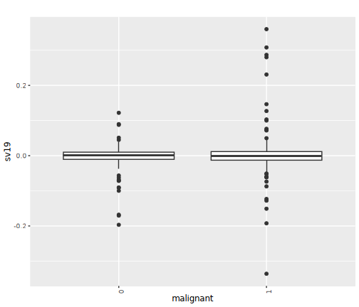
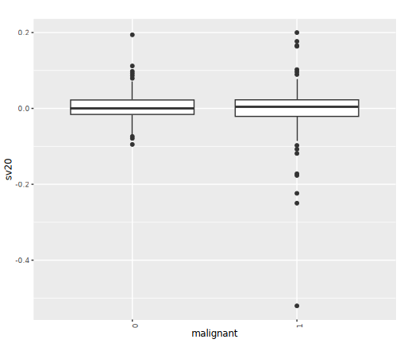
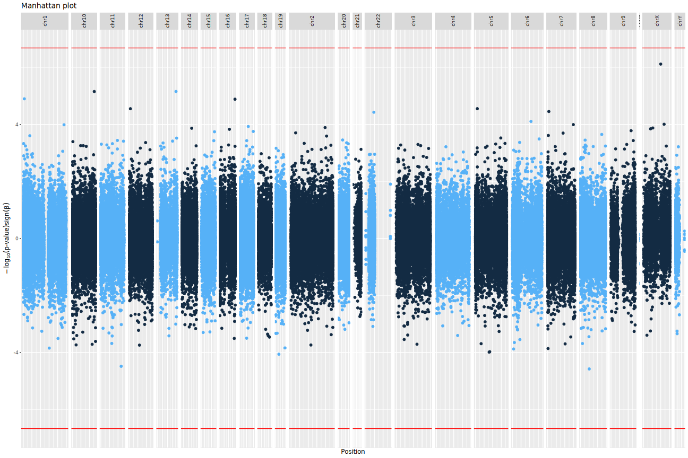
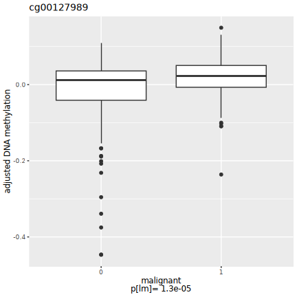
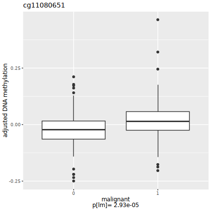
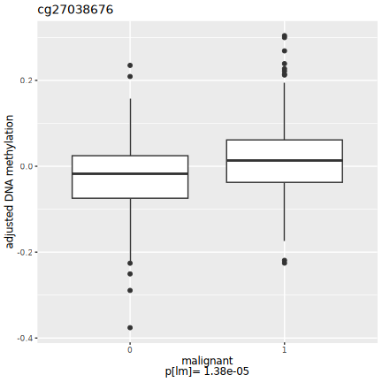
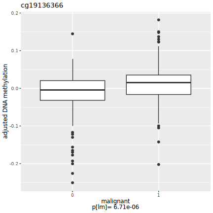
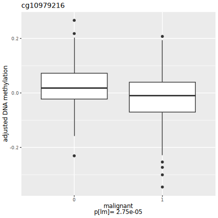
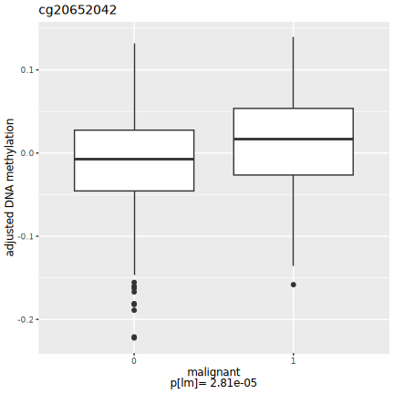

# Genome-wide methylation analysis report
- study: Pleural cfDNAm analysis of malignant.fulladjvariable
- author: Paul Yousefi
- date: 17 September, 2026

## Parameters


```
## $sig.threshold
## [1] 2.117738e-07
## 
## $max.plots
## [1] 10
## 
## $qq.inflation.method
## [1] "median"
## 
## $practical.threshold
## [1] 3.735308e-05
```

1/2                   
2/2 [unnamed-chunk-23]


## Sample characteristics

For continuous or ordinal variables, the "mean" column provides the mean
and the "sd/%" column the standard deviation of the variable.
For categorical variables, the "mean" column provides the number
of samples with the given "value" and the
"sd/%" column the percentage of samples with the given "value".


|variable  |value |mean          |sd..      |
|:---------|:-----|:-------------|:---------|
|malignant |      |0.5570033     |0.497551  |
|female    |      |0.3485342     |0.4772841 |
|age       |      |71.00977      |12.89614  |
|plate     |      |2.312704      |1.050957  |
|sv1       |      |-5.577726e-19 |0.0571662 |
|sv2       |      |-1.406461e-18 |0.0571662 |
|sv3       |      |2.309933e-18  |0.0571662 |
|sv4       |      |-3.926447e-18 |0.0571662 |
|sv5       |      |-1.580668e-18 |0.0571662 |
|sv6       |      |-4.394098e-18 |0.0571662 |
|sv7       |      |-7.367862e-19 |0.0571662 |
|sv8       |      |-8.787976e-18 |0.0571662 |
|sv9       |      |-8.369811e-18 |0.0571662 |
|sv10      |      |8.396166e-19  |0.0571662 |
|sv11      |      |-3.433601e-19 |0.0571662 |
|sv12      |      |-4.102255e-18 |0.0571662 |
|sv13      |      |-3.421616e-18 |0.0571662 |
|sv14      |      |-4.013948e-18 |0.0571662 |
|sv15      |      |-7.131808e-18 |0.0571662 |
|sv16      |      |-3.516406e-18 |0.0571662 |
|sv17      |      |8.104832e-18  |0.0571662 |
|sv18      |      |-2.325175e-16 |0.0571662 |
|sv19      |      |-1.790873e-15 |0.0571662 |
|sv20      |      |-2.73312e-15  |0.0571662 |


1/4                   
2/4 [unnamed-chunk-27]
3/4                   
4/4 [unnamed-chunk-28]


## Covariate associations


### Covariate female


statistics


|var1      |var2   |        F|   p-value|         R|   p-value|
|:---------|:------|--------:|---------:|---------:|---------:|
|malignant |female | 5.191268| 0.0233919| 0.1293665| 0.0233919|


### Covariate age


statistics


|var1      |var2 |        F|   p-value|        R|   p-value|
|:---------|:----|--------:|---------:|--------:|---------:|
|malignant |age  | 11.06231| 0.0009887| 0.163295| 0.0041207|


### Covariate plate


statistics


|var1      |var2  |        F|   p-value|          R|   p-value|
|:---------|:-----|--------:|---------:|----------:|---------:|
|malignant |plate | 3.680628| 0.0559814| -0.1096438| 0.0549757|


### Covariate sv1


statistics


|var1      |var2 |        F|   p-value|         R|   p-value|
|:---------|:----|--------:|---------:|---------:|---------:|
|malignant |sv1  | 7.052488| 0.0083315| 0.1500566| 0.0084534|


### Covariate sv2


statistics


|var1      |var2 |        F|   p-value|          R|   p-value|
|:---------|:----|--------:|---------:|----------:|---------:|
|malignant |sv2  | 1.103849| 0.2942547| -0.1061791| 0.0631585|


### Covariate sv3


statistics


|var1      |var2 |         F|   p-value|         R|   p-value|
|:---------|:----|---------:|---------:|---------:|---------:|
|malignant |sv3  | 0.0340678| 0.8536854| 0.0231596| 0.6860744|


### Covariate sv4


statistics


|var1      |var2 |         F|   p-value|          R|   p-value|
|:---------|:----|---------:|---------:|----------:|---------:|
|malignant |sv4  | 0.1055392| 0.7455037| -0.0017018| 0.9763089|


### Covariate sv5


statistics


|var1      |var2 |         F|   p-value|          R|   p-value|
|:---------|:----|---------:|---------:|----------:|---------:|
|malignant |sv5  | 0.1612805| 0.6882616| -0.0154644| 0.7872609|


### Covariate sv6


statistics


|var1      |var2 |        F|   p-value|          R|   p-value|
|:---------|:----|--------:|---------:|----------:|---------:|
|malignant |sv6  | 0.034955| 0.8518142| -0.0054754| 0.9238806|


### Covariate sv7


statistics


|var1      |var2 |         F|   p-value|          R|   p-value|
|:---------|:----|---------:|---------:|----------:|---------:|
|malignant |sv7  | 0.3453345| 0.5572009| -0.0235296| 0.6813317|


### Covariate sv8


statistics


|var1      |var2 |        F|   p-value|         R|   p-value|
|:---------|:----|--------:|---------:|---------:|---------:|
|malignant |sv8  | 3.199136| 0.0746695| 0.1214955| 0.0333389|


### Covariate sv9


statistics


|var1      |var2 |         F|   p-value|         R|  p-value|
|:---------|:----|---------:|---------:|---------:|--------:|
|malignant |sv9  | 0.1413264| 0.7072272| 0.0349984| 0.541261|


### Covariate sv10


statistics


|var1      |var2 |         F|   p-value|         R|   p-value|
|:---------|:----|---------:|---------:|---------:|---------:|
|malignant |sv10 | 0.0196993| 0.8884727| 0.0065113| 0.9095362|


### Covariate sv11


statistics


|var1      |var2 |         F|   p-value|         R|   p-value|
|:---------|:----|---------:|---------:|---------:|---------:|
|malignant |sv11 | 0.5754303| 0.4486949| 0.0543104| 0.3429189|


### Covariate sv12


statistics


|var1      |var2 |         F|   p-value|          R|   p-value|
|:---------|:----|---------:|---------:|----------:|---------:|
|malignant |sv12 | 0.7269295| 0.3945493| -0.0432116| 0.4506142|


### Covariate sv13


statistics


|var1      |var2 |         F|   p-value|         R|   p-value|
|:---------|:----|---------:|---------:|---------:|---------:|
|malignant |sv13 | 0.4432549| 0.5060588| 0.1088428| 0.0567848|


### Covariate sv14


statistics


|var1      |var2 |         F|   p-value|          R|   p-value|
|:---------|:----|---------:|---------:|----------:|---------:|
|malignant |sv14 | 0.7556725| 0.3853698| -0.0594159| 0.2994001|


### Covariate sv15


statistics


|var1      |var2 |         F|   p-value|         R|   p-value|
|:---------|:----|---------:|---------:|---------:|---------:|
|malignant |sv15 | 0.0666795| 0.7964084| 0.0667411| 0.2436431|


### Covariate sv16


statistics


|var1      |var2 |         F|   p-value|          R|   p-value|
|:---------|:----|---------:|---------:|----------:|---------:|
|malignant |sv16 | 0.1359494| 0.7125973| -0.0172402| 0.7635188|


### Covariate sv17


statistics


|var1      |var2 |        F|   p-value|         R|   p-value|
|:---------|:----|--------:|---------:|---------:|---------:|
|malignant |sv17 | 1.286935| 0.2575044| 0.0699228| 0.2218421|


### Covariate sv18


statistics


|var1      |var2 |        F|   p-value|          R|   p-value|
|:---------|:----|--------:|---------:|----------:|---------:|
|malignant |sv18 | 1.228582| 0.2685562| -0.0560122| 0.3279861|


### Covariate sv19


statistics


|var1      |var2 |       F|   p-value|       R|   p-value|
|:---------|:----|-------:|---------:|-------:|---------:|
|malignant |sv19 | 1.81885| 0.1784507| 7.4e-05| 0.9989698|





### Covariate sv20


statistics


|var1      |var2 |        F|   p-value|          R|   p-value|
|:---------|:----|--------:|---------:|----------:|---------:|
|malignant |sv20 | 1.378181| 0.2413271| -0.0285611| 0.6181383|





## QQ plots


## Manhattan plots




## Significant CpG sites

There were 0
CpG sites with association p-values < 2.1177377 &times; 10<sup>-7</sup>.
These are listed in the file [associations.csv](associations.csv).


Below are the 10
CpG sites with association p-values < 3.7353085 &times; 10<sup>-5</sup>
in the  regression model.


|           |chromosome |  position|   estimate|  p.value|  p.adjust|
|:----------|:----------|---------:|----------:|--------:|---------:|
|cg15034150 |chr7       |   7276930|  0.0477393| 3.52e-05| 1.0000000|
|cg16957989 |chr11      | 118213685| -0.0418557| 3.25e-05| 1.0000000|
|cg27358021 |chrX       |  99661597|  0.0718236| 8.00e-07| 0.1800717|
|cg00727940 |chr10      | 127586397|  0.0585462| 7.00e-06| 1.0000000|
|cg00127989 |chr1       |   5998680|  0.0416774| 1.26e-05| 1.0000000|
|cg11080651 |chr5       |  10445523|  0.0443134| 2.81e-05| 1.0000000|
|cg27038676 |chr16      |  88334272|  0.0510598| 1.30e-05| 1.0000000|
|cg19136366 |chr13      | 108876272|  0.0324059| 7.00e-06| 1.0000000|
|cg10979216 |chr8       |  50947399| -0.0471871| 2.62e-05| 1.0000000|
|cg20652042 |chr12      |   6883826|  0.0341274| 2.82e-05| 1.0000000|

Plots of these sites follow, one for each covariate set.
"p[lm]" denotes the p-value obtained using a linear model
and "p[beta]" the p-value obtained using beta regression.



















## Selected CpG sites

Number of CpG sites selected: 0.


|chromosome | position| estimate| p.value| p.adjust|
|:----------|--------:|--------:|-------:|--------:|


## R session information


```
## R version 4.4.2 (2024-10-31)
## Platform: x86_64-conda-linux-gnu
## Running under: Red Hat Enterprise Linux 8.10 (Ootpa)
## 
## Matrix products: default
## BLAS/LAPACK: /home/py16069/miniforge3/envs/r442/lib/libopenblasp-r0.3.28.so;  LAPACK version 3.12.0
## 
## locale:
##  [1] LC_CTYPE=C.UTF-8       LC_NUMERIC=C           LC_TIME=C.UTF-8       
##  [4] LC_COLLATE=C.UTF-8     LC_MONETARY=C.UTF-8    LC_MESSAGES=C.UTF-8   
##  [7] LC_PAPER=C.UTF-8       LC_NAME=C              LC_ADDRESS=C          
## [10] LC_TELEPHONE=C         LC_MEASUREMENT=C.UTF-8 LC_IDENTIFICATION=C   
## 
## time zone: Europe/London
## tzcode source: system (glibc)
## 
## attached base packages:
## [1] parallel  stats     graphics  grDevices utils     datasets  methods  
## [8] base     
## 
## other attached packages:
##  [1] gridExtra_2.3       Cairo_1.6-2         dplyr_1.1.4        
##  [4] purrr_1.0.2         ewaff_0.0.2         metafor_4.6-0      
##  [7] numDeriv_2016.8-1.1 metadat_1.2-0       Matrix_1.6-5       
## [10] mice_3.17.0         survival_3.8-3      sandwich_3.1-1     
## [13] lmtest_0.9-40       zoo_1.8-12          MASS_7.3-60.0.1    
## [16] limma_3.62.1        markdown_1.13       knitr_1.49         
## [19] SmartSVA_0.1.3      RSpectra_0.16-2     isva_1.9           
## [22] JADE_2.0-4          fastICA_1.2-7       qvalue_2.38.0      
## [25] sva_3.54.0          BiocParallel_1.40.0 genefilter_1.88.0  
## [28] mgcv_1.9-1          nlme_3.1-165        ggplot2_4.0.3      
## [31] eval.save_1.0.0    
## 
## loaded via a namespace (and not attached):
##  [1] DBI_1.2.3               rlang_1.1.4             magrittr_2.0.3         
##  [4] clue_0.3-66             matrixStats_1.5.0       compiler_4.4.2         
##  [7] RSQLite_2.3.9           png_0.1-8               vctrs_0.6.5            
## [10] reshape2_1.4.4          stringr_1.5.1           pkgconfig_2.0.3        
## [13] shape_1.4.6.1           crayon_1.5.3            fastmap_1.2.0          
## [16] backports_1.5.0         XVector_0.46.0          labeling_0.4.3         
## [19] tzdb_0.4.0              nloptr_2.1.1            UCSC.utils_1.2.0       
## [22] bit_4.5.0.1             xfun_0.52               glmnet_4.1-8           
## [25] jomo_2.7-6              zlibbioc_1.52.0         cachem_1.1.0           
## [28] GenomeInfoDb_1.42.0     jsonlite_1.8.9          blob_1.2.4             
## [31] pan_1.9                 broom_1.0.7             cluster_2.1.8          
## [34] R6_2.5.1                stringi_1.8.4           RColorBrewer_1.1-3     
## [37] rpart_4.1.24            boot_1.3-31             Rcpp_1.0.13-1          
## [40] iterators_1.0.14        readr_2.1.5             IRanges_2.40.0         
## [43] nnet_7.3-20             splines_4.4.2           tidyselect_1.2.1       
## [46] yaml_2.3.10             codetools_0.2-20        lattice_0.22-6         
## [49] tibble_3.2.1            plyr_1.8.9              Biobase_2.66.0         
## [52] withr_3.0.2             KEGGREST_1.46.0         S7_0.2.0               
## [55] evaluate_1.0.1          Biostrings_2.74.0       pillar_1.10.1          
## [58] MatrixGenerics_1.18.0   foreach_1.5.2           stats4_4.4.2           
## [61] generics_0.1.3          mathjaxr_1.6-0          hms_1.1.3              
## [64] S4Vectors_0.44.0        commonmark_1.9.5        scales_1.4.0           
## [67] minqa_1.2.8             xtable_1.8-4            glue_1.8.0             
## [70] tools_4.4.2             lme4_1.1-35.5           annotate_1.84.0        
## [73] locfit_1.5-9.10         XML_3.99-0.17           grid_4.4.2             
## [76] tidyr_1.3.1             AnnotationDbi_1.68.0    edgeR_4.4.0            
## [79] GenomeInfoDbData_1.2.13 cli_3.6.3               config_0.3.2           
## [82] gtable_0.3.6            BiocGenerics_0.52.0     farver_2.1.2           
## [85] memoise_2.0.1           lifecycle_1.0.4         httr_1.4.7             
## [88] mime_0.12               mitml_0.4-5             statmod_1.5.0          
## [91] bit64_4.5.2
```
