# Genome-wide methylation analysis report
- study: Pleural cfDNAm analysis of malignant.fulladjvariable
- author: Paul Yousefi
- date: 08 October, 2026

## Parameters


```
## $sig.threshold
## [1] 2.121143e-07
## 
## $max.plots
## [1] 10
## 
## $qq.inflation.method
## [1] "median"
## 
## $practical.threshold
## [1] 9.844806e-05
```

1/2                   
2/2 [unnamed-chunk-23]


## Sample characteristics

For continuous or ordinal variables, the "mean" column provides the mean
and the "sd/%" column the standard deviation of the variable.
For categorical variables, the "mean" column provides the number
of samples with the given "value" and the
"sd/%" column the percentage of samples with the given "value".


|variable  |value |mean          |sd..      |
|:---------|:-----|:-------------|:---------|
|malignant |      |0.5537459     |0.4979146 |
|female    |      |0.3517915     |0.478309  |
|age       |      |71.00326      |12.89006  |
|plate     |      |2.319218      |1.048991  |
|sv1       |      |-1.992045e-19 |0.0571662 |
|sv2       |      |-9.380821e-21 |0.0571662 |
|sv3       |      |2.40149e-20   |0.0571662 |
|sv4       |      |-1.409816e-18 |0.0571662 |
|sv5       |      |-9.229624e-19 |0.0571662 |
|sv6       |      |-8.895667e-19 |0.0571662 |
|sv7       |      |3.33619e-18   |0.0571662 |
|sv8       |      |8.317474e-16  |0.0571662 |
|sv9       |      |2.231674e-14  |0.0571662 |
|sv10      |      |1.244293e-12  |0.0571662 |


1/4                   
2/4 [unnamed-chunk-27]
3/4                   
4/4 [unnamed-chunk-28]


## Covariate associations


### Covariate female


statistics


|var1      |var2   |        F|   p-value|         R|   p-value|
|:---------|:------|--------:|---------:|---------:|---------:|
|malignant |female | 4.934526| 0.0270593| 0.1261792| 0.0270593|


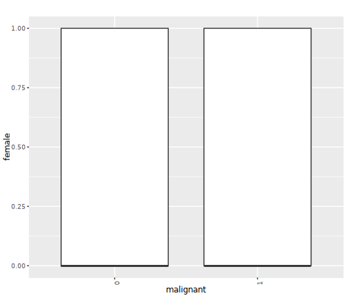


### Covariate age


statistics


|var1      |var2 |        F| p-value|         R|   p-value|
|:---------|:----|--------:|-------:|---------:|---------:|
|malignant |age  | 10.32879| 0.00145| 0.1561484| 0.0061137|


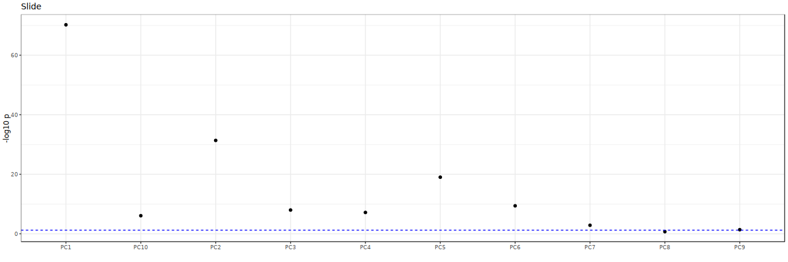


### Covariate plate


statistics


|var1      |var2  |        F|   p-value|          R|   p-value|
|:---------|:-----|--------:|---------:|----------:|---------:|
|malignant |plate | 3.601985| 0.0586547| -0.1085678| 0.0574172|


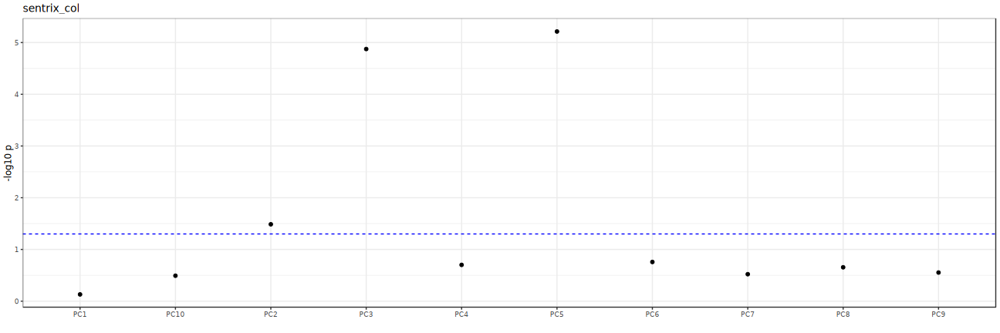


### Covariate sv1


statistics


|var1      |var2 |        F|   p-value|         R|   p-value|
|:---------|:----|--------:|---------:|---------:|---------:|
|malignant |sv1  | 6.816443| 0.0094785| 0.1502427| 0.0083714|


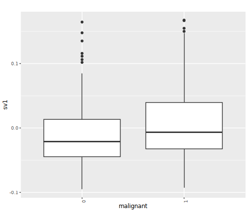


### Covariate sv2


statistics


|var1      |var2 |        F|   p-value|         R|   p-value|
|:---------|:----|--------:|---------:|---------:|---------:|
|malignant |sv2  | 1.286164| 0.2576466| 0.0950847| 0.0963139|


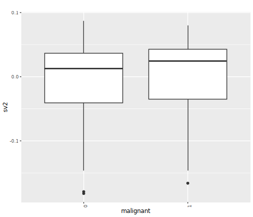


### Covariate sv3


statistics


|var1      |var2 |         F|   p-value|         R|   p-value|
|:---------|:----|---------:|---------:|---------:|---------:|
|malignant |sv3  | 0.0285168| 0.8660114| 0.0166361| 0.7715718|


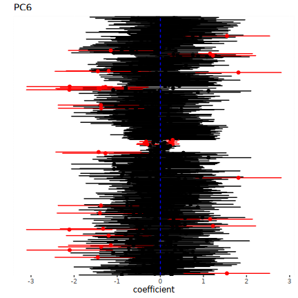


### Covariate sv4


statistics


|var1      |var2 |         F|  p-value|          R|   p-value|
|:---------|:----|---------:|--------:|----------:|---------:|
|malignant |sv4  | 0.0640363| 0.800397| -0.0160446| 0.7794808|


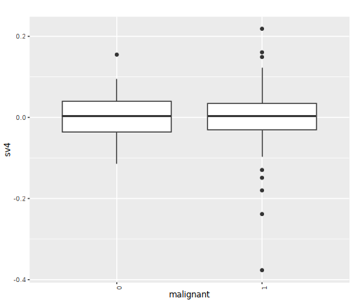


### Covariate sv5


statistics


|var1      |var2 |         F|   p-value|          R|   p-value|
|:---------|:----|---------:|---------:|----------:|---------:|
|malignant |sv5  | 0.0514554| 0.8207019| -0.0042145| 0.9413741|


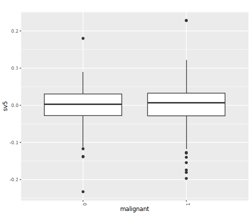


### Covariate sv6


statistics


|var1      |var2 |         F|   p-value|        R|   p-value|
|:---------|:----|---------:|---------:|--------:|---------:|
|malignant |sv6  | 0.1026181| 0.7489295| 0.014418| 0.8013456|


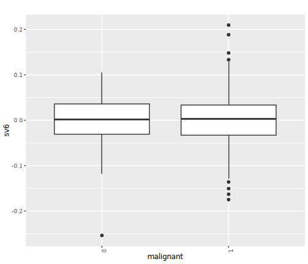


### Covariate sv7


statistics


|var1      |var2 |         F|   p-value|          R|   p-value|
|:---------|:----|---------:|---------:|----------:|---------:|
|malignant |sv7  | 0.8627295| 0.3537105| -0.0422927| 0.4603102|


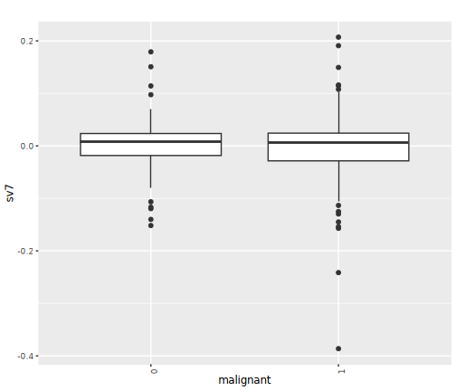


### Covariate sv8


statistics


|var1      |var2 |        F|  p-value|          R|   p-value|
|:---------|:----|--------:|--------:|----------:|---------:|
|malignant |sv8  | 0.690949| 0.406492| -0.0580416| 0.3107367|


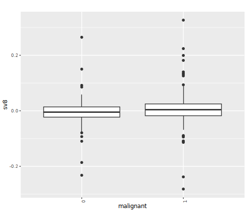


### Covariate sv9


statistics


|var1      |var2 |        F|   p-value|          R|   p-value|
|:---------|:----|--------:|---------:|----------:|---------:|
|malignant |sv9  | 1.257802| 0.2629497| -0.0327547| 0.5675111|


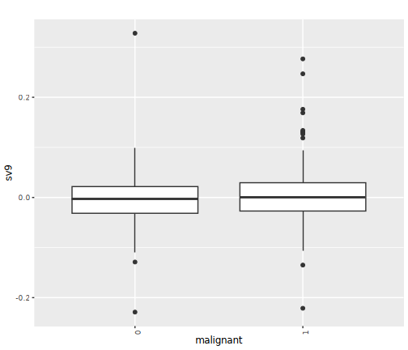


### Covariate sv10


statistics


|var1      |var2 |        F|   p-value|          R|   p-value|
|:---------|:----|--------:|---------:|----------:|---------:|
|malignant |sv10 | 2.817042| 0.0942924| -0.0642524| 0.2617089|


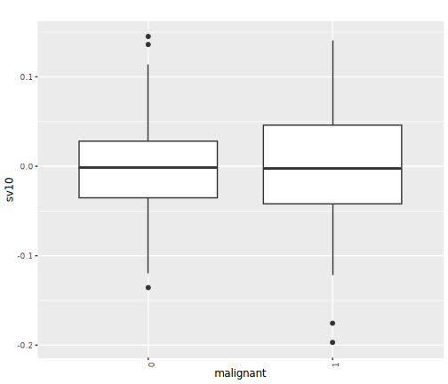


## QQ plots


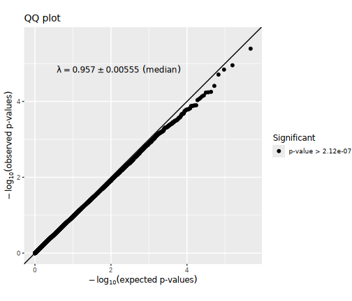

## Manhattan plots


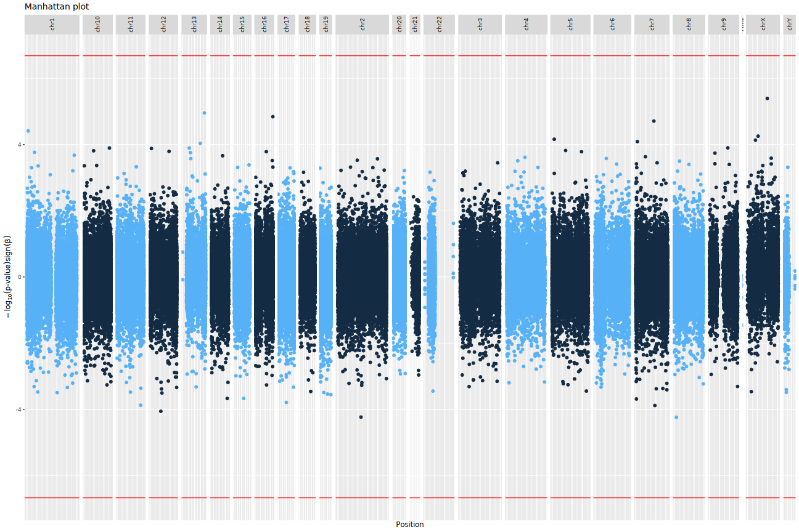

## Significant CpG sites

There were 0
CpG sites with association p-values < 2.1211427 &times; 10<sup>-7</sup>.
These are listed in the file [associations.csv](associations.csv).


Below are the 10
CpG sites with association p-values < 9.8448059 &times; 10<sup>-5</sup>
in the  regression model.


|           |chromosome |  position|   estimate|  p.value| p.adjust|
|:----------|:----------|---------:|----------:|--------:|--------:|
|cg15034150 |chr7       |   7276930|  0.0476012| 7.03e-05|        1|
|cg17642208 |chr12      |  54151110| -0.0289582| 9.57e-05|        1|
|cg27358021 |chrX       |  99661597|  0.0684385| 6.30e-06|        1|
|cg00127989 |chr1       |   5998680|  0.0408620| 3.31e-05|        1|
|cg11080651 |chr5       |  10445523|  0.0423250| 6.36e-05|        1|
|cg27038676 |chr16      |  88334272|  0.0533149| 2.68e-05|        1|
|cg19136366 |chr13      | 108876272|  0.0337419| 1.13e-05|        1|
|cg19651219 |chr2       | 115419729| -0.0478473| 4.22e-05|        1|
|cg04549111 |chr7       |  90138040|  0.0326080| 3.12e-05|        1|
|cg20652042 |chr12      |   6883826|  0.0332556| 5.75e-05|        1|

Plots of these sites follow, one for each covariate set.
"p[lm]" denotes the p-value obtained using a linear model
and "p[beta]" the p-value obtained using beta regression.


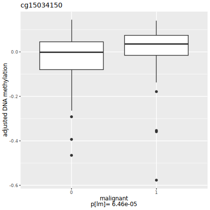


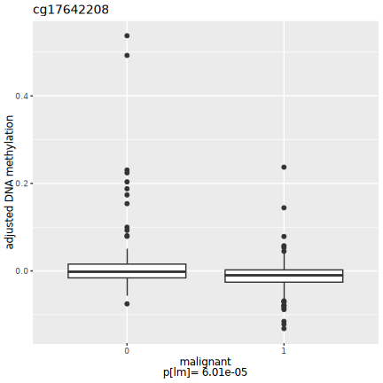


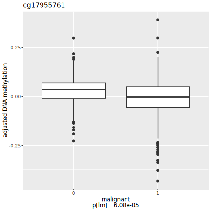


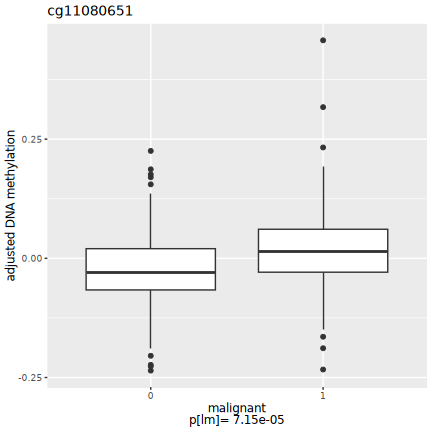


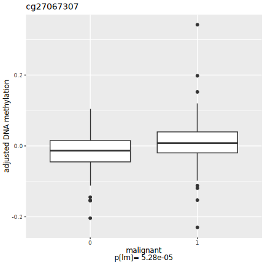


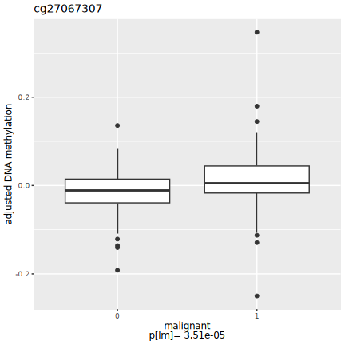


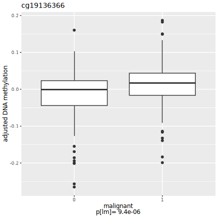


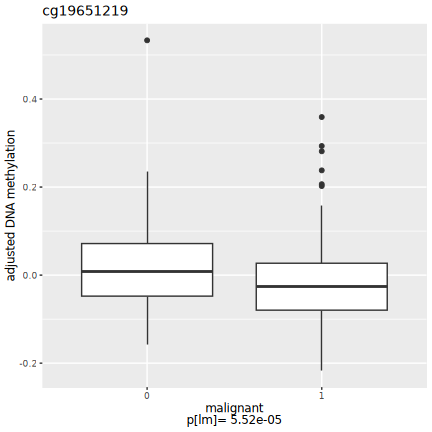


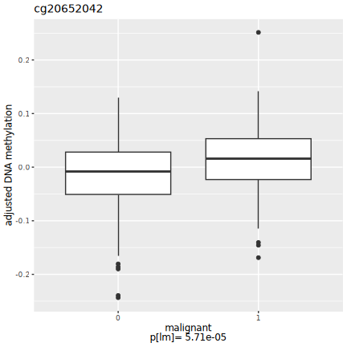

## Selected CpG sites

Number of CpG sites selected: 0.


|chromosome | position| estimate| p.value| p.adjust|
|:----------|--------:|--------:|-------:|--------:|


## R session information


```
## R version 4.4.2 (2024-10-31)
## Platform: x86_64-conda-linux-gnu
## Running under: Red Hat Enterprise Linux 8.10 (Ootpa)
## 
## Matrix products: default
## BLAS/LAPACK: /home/py16069/miniforge3/envs/r442/lib/libopenblasp-r0.3.28.so;  LAPACK version 3.12.0
## 
## locale:
##  [1] LC_CTYPE=C.UTF-8       LC_NUMERIC=C           LC_TIME=C.UTF-8       
##  [4] LC_COLLATE=C.UTF-8     LC_MONETARY=C.UTF-8    LC_MESSAGES=C.UTF-8   
##  [7] LC_PAPER=C.UTF-8       LC_NAME=C              LC_ADDRESS=C          
## [10] LC_TELEPHONE=C         LC_MEASUREMENT=C.UTF-8 LC_IDENTIFICATION=C   
## 
## time zone: Europe/London
## tzcode source: system (glibc)
## 
## attached base packages:
## [1] parallel  stats     graphics  grDevices utils     datasets  methods  
## [8] base     
## 
## other attached packages:
##  [1] gridExtra_2.3       Cairo_1.6-2         dplyr_1.1.4        
##  [4] purrr_1.0.2         ewaff_0.0.2         metafor_4.6-0      
##  [7] numDeriv_2016.8-1.1 metadat_1.2-0       Matrix_1.6-5       
## [10] mice_3.17.0         survival_3.8-3      sandwich_3.1-1     
## [13] lmtest_0.9-40       zoo_1.8-12          MASS_7.3-60.0.1    
## [16] limma_3.62.1        markdown_1.13       knitr_1.49         
## [19] SmartSVA_0.1.3      RSpectra_0.16-2     isva_1.9           
## [22] JADE_2.0-4          fastICA_1.2-7       qvalue_2.38.0      
## [25] sva_3.54.0          BiocParallel_1.40.0 genefilter_1.88.0  
## [28] mgcv_1.9-1          nlme_3.1-165        ggplot2_4.0.3      
## [31] eval.save_1.0.0    
## 
## loaded via a namespace (and not attached):
##  [1] DBI_1.2.3               rlang_1.1.4             magrittr_2.0.3         
##  [4] clue_0.3-66             matrixStats_1.5.0       compiler_4.4.2         
##  [7] RSQLite_2.3.9           png_0.1-8               vctrs_0.6.5            
## [10] reshape2_1.4.4          stringr_1.5.1           pkgconfig_2.0.3        
## [13] shape_1.4.6.1           crayon_1.5.3            fastmap_1.2.0          
## [16] backports_1.5.0         XVector_0.46.0          labeling_0.4.3         
## [19] tzdb_0.4.0              nloptr_2.1.1            UCSC.utils_1.2.0       
## [22] bit_4.5.0.1             xfun_0.52               glmnet_4.1-8           
## [25] jomo_2.7-6              zlibbioc_1.52.0         cachem_1.1.0           
## [28] GenomeInfoDb_1.42.0     jsonlite_1.8.9          blob_1.2.4             
## [31] pan_1.9                 broom_1.0.7             cluster_2.1.8          
## [34] R6_2.5.1                stringi_1.8.4           RColorBrewer_1.1-3     
## [37] rpart_4.1.24            boot_1.3-31             Rcpp_1.0.13-1          
## [40] iterators_1.0.14        readr_2.1.5             IRanges_2.40.0         
## [43] nnet_7.3-20             splines_4.4.2           tidyselect_1.2.1       
## [46] yaml_2.3.10             codetools_0.2-20        lattice_0.22-6         
## [49] tibble_3.2.1            plyr_1.8.9              Biobase_2.66.0         
## [52] withr_3.0.2             KEGGREST_1.46.0         S7_0.2.0               
## [55] evaluate_1.0.1          Biostrings_2.74.0       pillar_1.10.1          
## [58] MatrixGenerics_1.18.0   foreach_1.5.2           stats4_4.4.2           
## [61] generics_0.1.3          mathjaxr_1.6-0          hms_1.1.3              
## [64] S4Vectors_0.44.0        commonmark_1.9.5        scales_1.4.0           
## [67] minqa_1.2.8             xtable_1.8-4            glue_1.8.0             
## [70] tools_4.4.2             lme4_1.1-35.5           annotate_1.84.0        
## [73] locfit_1.5-9.10         XML_3.99-0.17           grid_4.4.2             
## [76] tidyr_1.3.1             AnnotationDbi_1.68.0    edgeR_4.4.0            
## [79] GenomeInfoDbData_1.2.13 cli_3.6.3               config_0.3.2           
## [82] gtable_0.3.6            BiocGenerics_0.52.0     farver_2.1.2           
## [85] memoise_2.0.1           lifecycle_1.0.4         httr_1.4.7             
## [88] mime_0.12               mitml_0.4-5             statmod_1.5.0          
## [91] bit64_4.5.2
```
