# Genome-wide methylation analysis report
- study: Pleural cfDNAm analysis of malignantvariable
- author: Paul Yousefi
- date: 19 June, 2026

## Parameters


```
## $sig.threshold
## [1] 2.117738e-07
## 
## $max.plots
## [1] 10
## 
## $qq.inflation.method
## [1] "median"
## 
## $practical.threshold
## [1] 4.086623e-05
```

1/2                   
2/2 [unnamed-chunk-23]


## Sample characteristics

For continuous or ordinal variables, the "mean" column provides the mean
and the "sd/%" column the standard deviation of the variable.
For categorical variables, the "mean" column provides the number
of samples with the given "value" and the
"sd/%" column the percentage of samples with the given "value".


|variable  |value |mean          |sd..       |
|:---------|:-----|:-------------|:----------|
|malignant |      |0.5551948     |0.4977529  |
|sv1       |      |-2.858791e-19 |0.05707301 |
|sv2       |      |3.191642e-18  |0.05707301 |
|sv3       |      |-2.152388e-18 |0.05707301 |
|sv4       |      |6.114676e-18  |0.05707301 |
|sv5       |      |7.241164e-18  |0.05707301 |
|sv6       |      |-7.266971e-18 |0.05707301 |
|sv7       |      |1.069396e-17  |0.05707301 |
|sv8       |      |-1.501118e-18 |0.05707301 |
|sv9       |      |6.825766e-18  |0.05707301 |
|sv10      |      |1.304337e-17  |0.05707301 |
|sv11      |      |3.660172e-19  |0.05707301 |
|sv12      |      |1.250922e-17  |0.05707301 |
|sv13      |      |-1.989009e-18 |0.05707301 |
|sv14      |      |-1.288954e-17 |0.05707301 |
|sv15      |      |-1.035268e-18 |0.05707301 |
|sv16      |      |-1.27737e-19  |0.05707301 |
|sv17      |      |-9.019993e-18 |0.05707301 |
|sv18      |      |-3.280658e-19 |0.05707301 |
|sv19      |      |2.347568e-18  |0.05707301 |
|sv20      |      |-1.080484e-17 |0.05707301 |
|sv21      |      |5.738478e-18  |0.05707301 |
|sv22      |      |-3.880934e-18 |0.05707301 |
|sv23      |      |-2.783999e-18 |0.05707301 |
|sv24      |      |6.430014e-18  |0.05707301 |
|sv25      |      |-2.939534e-18 |0.05707301 |
|sv26      |      |2.696573e-18  |0.05707301 |
|sv27      |      |1.983509e-18  |0.05707301 |
|sv28      |      |4.078524e-18  |0.05707301 |
|sv29      |      |-2.050277e-18 |0.05707301 |
|sv30      |      |2.695154e-18  |0.05707301 |
|sv31      |      |-7.916084e-18 |0.05707301 |
|sv32      |      |-3.169619e-18 |0.05707301 |


1/4                   
2/4 [unnamed-chunk-27]
3/4                   
4/4 [unnamed-chunk-28]


## Covariate associations


### Covariate sv1


statistics


|var1      |var2 |        F|   p-value|          R|   p-value|
|:---------|:----|--------:|---------:|----------:|---------:|
|malignant |sv1  | 7.473229| 0.0066269| -0.1530273| 0.0071332|


### Covariate sv2


statistics


|var1      |var2 |        F|   p-value|         R|   p-value|
|:---------|:----|--------:|---------:|---------:|---------:|
|malignant |sv2  | 1.058006| 0.3044828| 0.0965192| 0.0908428|


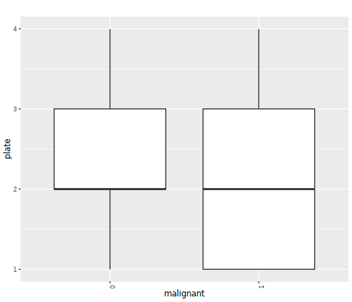


### Covariate sv3


statistics


|var1      |var2 |         F|   p-value|         R|   p-value|
|:---------|:----|---------:|---------:|---------:|---------:|
|malignant |sv3  | 0.0424459| 0.8369091| 0.0245064| 0.6683589|


### Covariate sv4


statistics


|var1      |var2 |         F|   p-value|         R|   p-value|
|:---------|:----|---------:|---------:|---------:|---------:|
|malignant |sv4  | 0.0417216| 0.8382873| 0.0067971| 0.9054295|


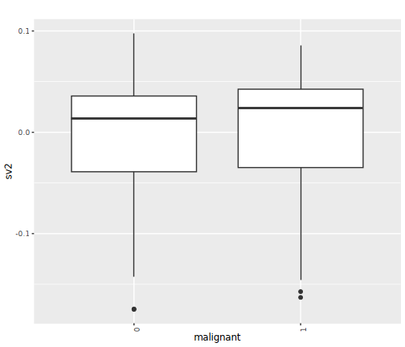


### Covariate sv5


statistics


|var1      |var2 |         F|   p-value|         R|   p-value|
|:---------|:----|---------:|---------:|---------:|---------:|
|malignant |sv5  | 0.3390436| 0.5608106| 0.0439058| 0.4426175|


### Covariate sv6


statistics


|var1      |var2 |         F|   p-value|          R|   p-value|
|:---------|:----|---------:|---------:|----------:|---------:|
|malignant |sv6  | 0.0576064| 0.8104805| -0.0048866| 0.9319346|


### Covariate sv7


statistics


|var1      |var2 |         F|   p-value|         R|   p-value|
|:---------|:----|---------:|---------:|---------:|---------:|
|malignant |sv7  | 0.1215001| 0.7276528| 0.0160559| 0.7789768|


### Covariate sv8


statistics


|var1      |var2 |        F|   p-value|         R|   p-value|
|:---------|:----|--------:|---------:|---------:|---------:|
|malignant |sv8  | 3.450638| 0.0641878| 0.1303212| 0.0221613|


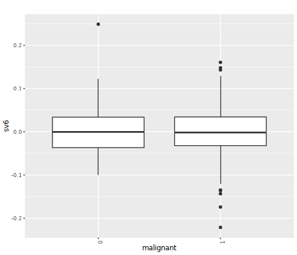


### Covariate sv9


statistics


|var1      |var2 |         F|   p-value|        R|   p-value|
|:---------|:----|---------:|---------:|--------:|---------:|
|malignant |sv9  | 0.1672256| 0.6828754| 0.002976| 0.9585151|


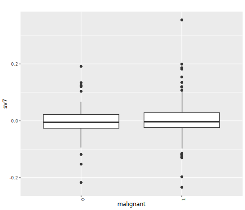


### Covariate sv10


statistics


|var1      |var2 |         F|   p-value|          R|   p-value|
|:---------|:----|---------:|---------:|----------:|---------:|
|malignant |sv10 | 0.0152624| 0.9017597| -0.0018003| 0.9748971|


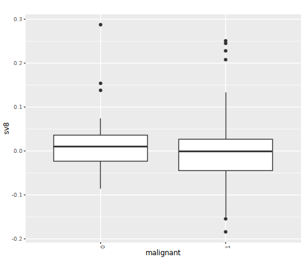


### Covariate sv11


statistics


|var1      |var2 |         F|  p-value|         R|   p-value|
|:---------|:----|---------:|--------:|---------:|---------:|
|malignant |sv11 | 0.0417264| 0.838278| 0.0289888| 0.6123022|


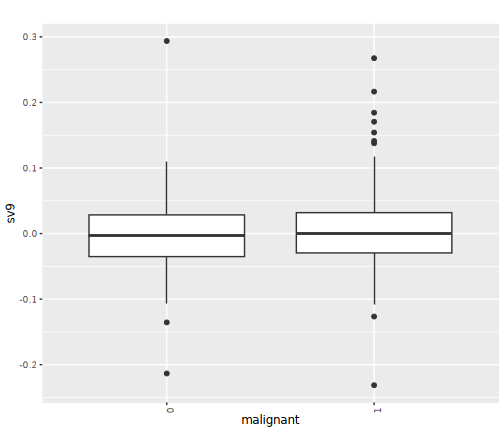


### Covariate sv12


statistics


|var1      |var2 |        F|   p-value|          R|   p-value|
|:---------|:----|--------:|---------:|----------:|---------:|
|malignant |sv12 | 1.685797| 0.1951336| -0.0716822| 0.2096544|


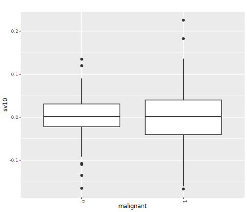


### Covariate sv13


statistics


|var1      |var2 |         F|   p-value|          R|   p-value|
|:---------|:----|---------:|---------:|----------:|---------:|
|malignant |sv13 | 0.1568146| 0.6923823| -0.0470655| 0.4104543|


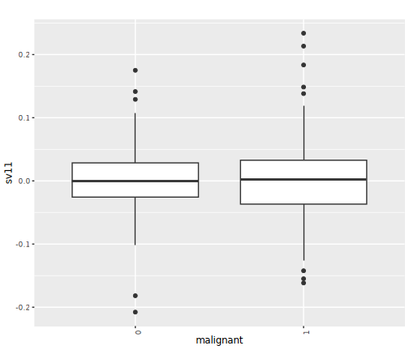


### Covariate sv14


statistics


|var1      |var2 |         F|   p-value|          R|   p-value|
|:---------|:----|---------:|---------:|----------:|---------:|
|malignant |sv14 | 0.3474707| 0.5559834| -0.0684489| 0.2309969|


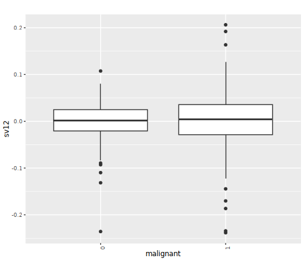


### Covariate sv15


statistics


|var1      |var2 |         F|   p-value|       R|   p-value|
|:---------|:----|---------:|---------:|-------:|---------:|
|malignant |sv15 | 0.0297502| 0.8631723| 0.04927| 0.3888566|


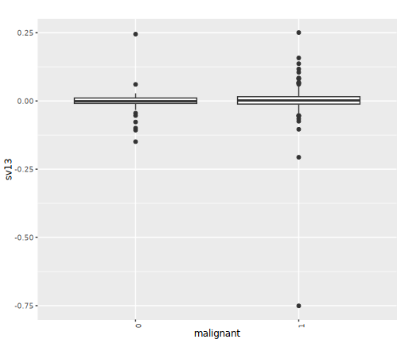


### Covariate sv16


statistics


|var1      |var2 |         F|   p-value|          R|   p-value|
|:---------|:----|---------:|---------:|----------:|---------:|
|malignant |sv16 | 0.0411432| 0.8393966| -0.0315607| 0.5811033|


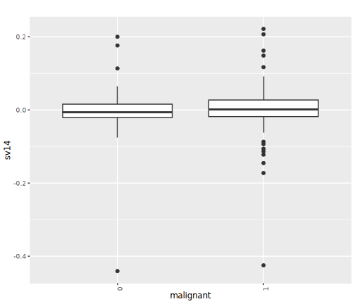


### Covariate sv17


statistics


|var1      |var2 |         F|   p-value|         R|   p-value|
|:---------|:----|---------:|---------:|---------:|---------:|
|malignant |sv17 | 0.4809922| 0.4884993| 0.0041518| 0.9421506|


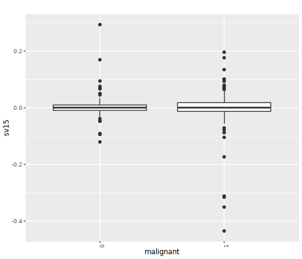


### Covariate sv18


statistics


|var1      |var2 |        F|   p-value|          R|   p-value|
|:---------|:----|--------:|---------:|----------:|---------:|
|malignant |sv18 | 2.016535| 0.1566119| -0.0613946| 0.2827762|


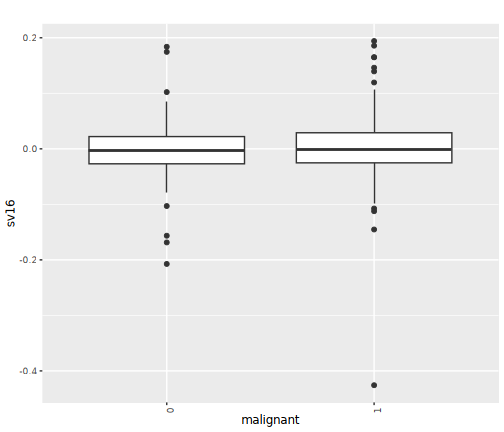


### Covariate sv19


statistics


|var1      |var2 |        F|  p-value|          R|   p-value|
|:---------|:----|--------:|--------:|----------:|---------:|
|malignant |sv19 | 2.645558| 0.104869| -0.0699186| 0.2211126|


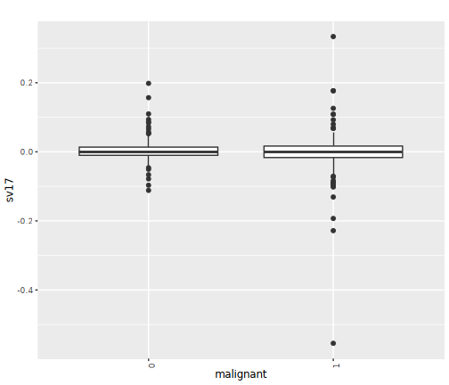


### Covariate sv20


statistics


|var1      |var2 |         F|   p-value|          R|   p-value|
|:---------|:----|---------:|---------:|----------:|---------:|
|malignant |sv20 | 0.2603571| 0.6102428| -0.0281071| 0.6231661|


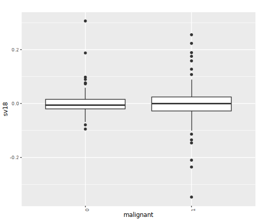


### Covariate sv21


statistics


|var1      |var2 |        F|   p-value|          R|   p-value|
|:---------|:----|--------:|---------:|----------:|---------:|
|malignant |sv21 | 2.143094| 0.1442393| -0.0728579| 0.2022572|


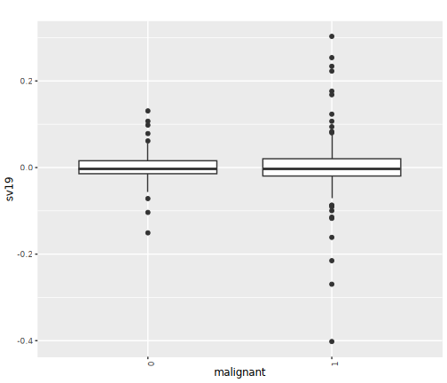


### Covariate sv22


statistics


|var1      |var2 |        F|   p-value|        R|   p-value|
|:---------|:----|--------:|---------:|--------:|---------:|
|malignant |sv22 | 3.457121| 0.0639396| 0.099532| 0.0811572|


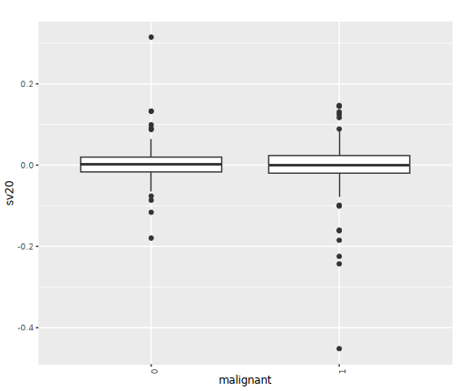


### Covariate sv23


statistics


|var1      |var2 |         F|   p-value|          R|   p-value|
|:---------|:----|---------:|---------:|----------:|---------:|
|malignant |sv23 | 0.3466731| 0.5564369| -0.0012859| 0.9820679|


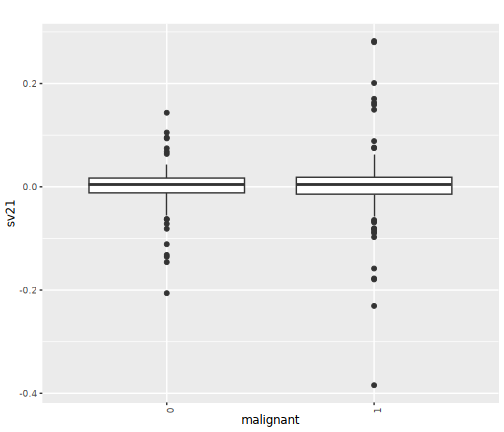


### Covariate sv24


statistics


|var1      |var2 |        F|   p-value|         R|   p-value|
|:---------|:----|--------:|---------:|---------:|---------:|
|malignant |sv24 | 3.687237| 0.0557597| 0.0824106| 0.1490557|


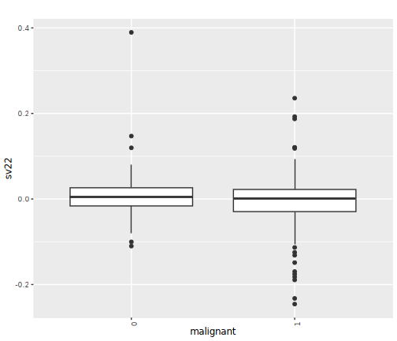


### Covariate sv25


statistics


|var1      |var2 |        F|   p-value|          R|   p-value|
|:---------|:----|--------:|---------:|----------:|---------:|
|malignant |sv25 | 1.391241| 0.2391118| -0.0293563| 0.6078003|


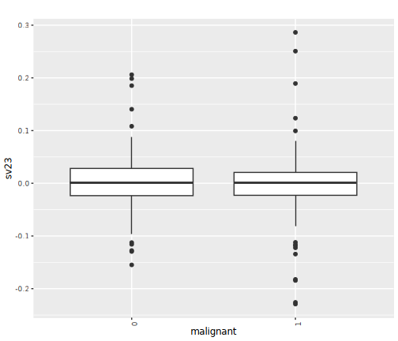


### Covariate sv26


statistics


|var1      |var2 |         F|   p-value|          R|  p-value|
|:---------|:----|---------:|---------:|----------:|--------:|
|malignant |sv26 | 0.0004204| 0.9836558| -0.0239186| 0.675858|


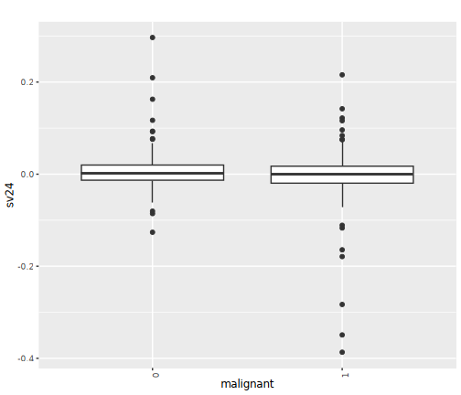


### Covariate sv27


statistics


|var1      |var2 |         F|   p-value|          R|   p-value|
|:---------|:----|---------:|---------:|----------:|---------:|
|malignant |sv27 | 0.4168559| 0.5189939| -0.0544873| 0.3405558|


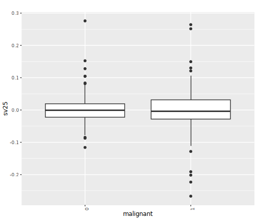


### Covariate sv28


statistics


|var1      |var2 |         F|   p-value|          R|   p-value|
|:---------|:----|---------:|---------:|----------:|---------:|
|malignant |sv28 | 0.7247526| 0.3952551| -0.0569122| 0.3194685|


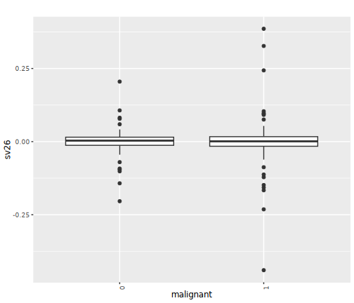


### Covariate sv29


statistics


|var1      |var2 |         F|   p-value|          R|   p-value|
|:---------|:----|---------:|---------:|----------:|---------:|
|malignant |sv29 | 0.1138793| 0.7360015| -0.0156885| 0.7839082|


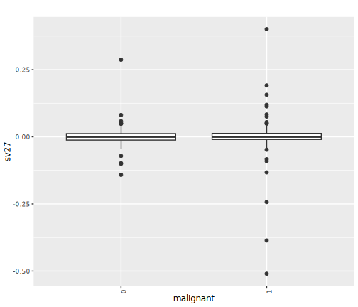


### Covariate sv30


statistics


|var1      |var2 |         F| p-value|         R|   p-value|
|:---------|:----|---------:|-------:|---------:|---------:|
|malignant |sv30 | 0.0712189| 0.78975| 0.0128962| 0.8216556|


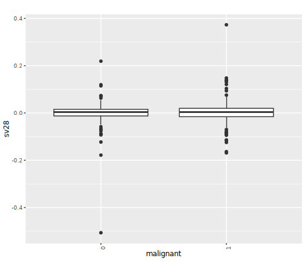


### Covariate sv31


statistics


|var1      |var2 |         F|   p-value|         R|   p-value|
|:---------|:----|---------:|---------:|---------:|---------:|
|malignant |sv31 | 0.0161225| 0.8990439| 0.0227428| 0.6909519|


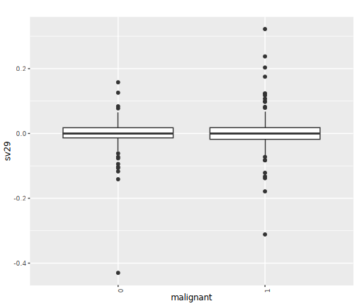


### Covariate sv32


statistics


|var1      |var2 |         F|   p-value|        R|   p-value|
|:---------|:----|---------:|---------:|--------:|---------:|
|malignant |sv32 | 0.3969382| 0.5291449| 0.116433| 0.0411483|


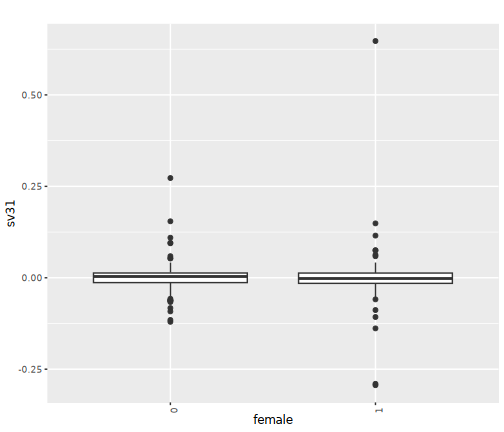


## QQ plots


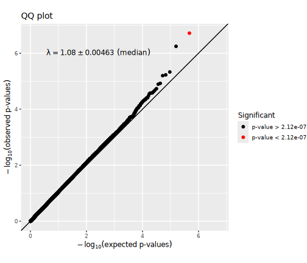

## Manhattan plots


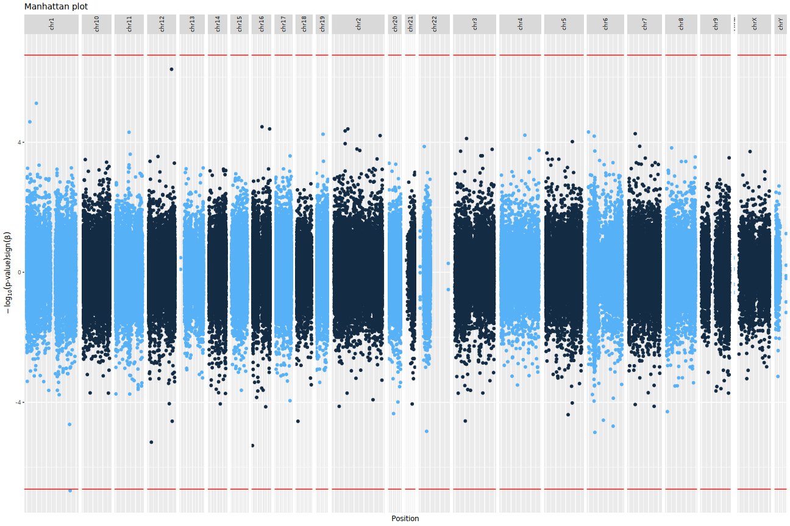

## Significant CpG sites

There were 0
CpG sites with association p-values < 2.1177377 &times; 10<sup>-7</sup>.
These are listed in the file [associations.csv](associations.csv).


Below are the 10
CpG sites with association p-values < 4.0866226 &times; 10<sup>-5</sup>
in the  regression model.


|           |chromosome |  position|   estimate|  p.value| p.adjust|
|:----------|:----------|---------:|----------:|--------:|--------:|
|cg15034150 |chr7       |   7276930|  0.0476267| 1.95e-05| 1.000000|
|cg27358021 |chrX       |  99661597|  0.0603963| 1.03e-05| 1.000000|
|cg25685359 |chr22      |  46473721|  0.0591308| 2.07e-05| 1.000000|
|cg24392939 |chr3       |  97591258| -0.0351579| 2.18e-05| 1.000000|
|cg26943453 |chrX       |  40505770|  0.0482709| 3.90e-05| 1.000000|
|cg19136366 |chr13      | 108876272|  0.0329959| 2.60e-06| 0.611772|
|cg06441492 |chr4       |  36101094| -0.0350684| 1.28e-05| 1.000000|
|cg27503926 |chrX       | 119443160|  0.0494327| 3.30e-05| 1.000000|
|cg02216944 |chr1       | 242266469| -0.0441657| 4.07e-05| 1.000000|
|cg22078571 |chr14      | 103388915|  0.0278674| 2.46e-05| 1.000000|

Plots of these sites follow, one for each covariate set.
"p[lm]" denotes the p-value obtained using a linear model
and "p[beta]" the p-value obtained using beta regression.


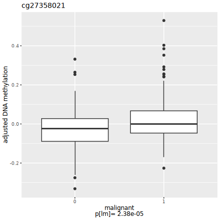


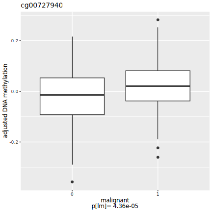


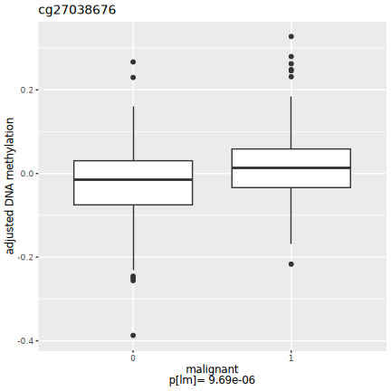


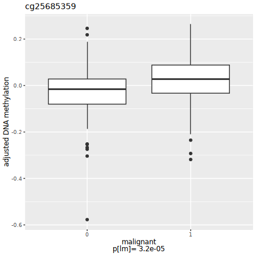


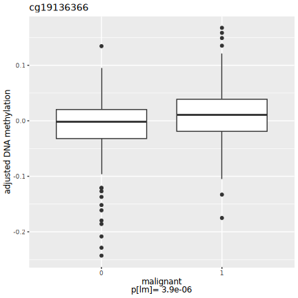


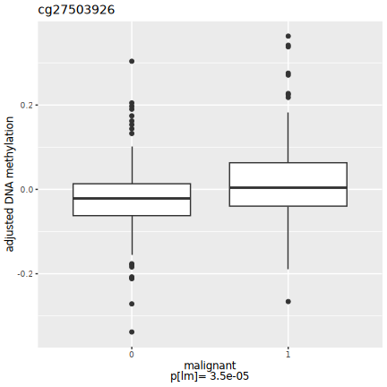


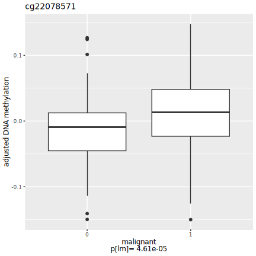


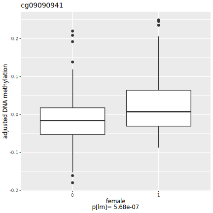


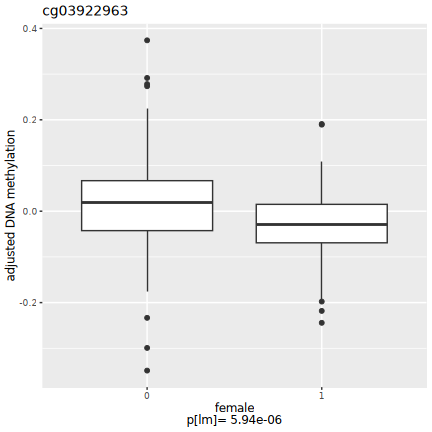


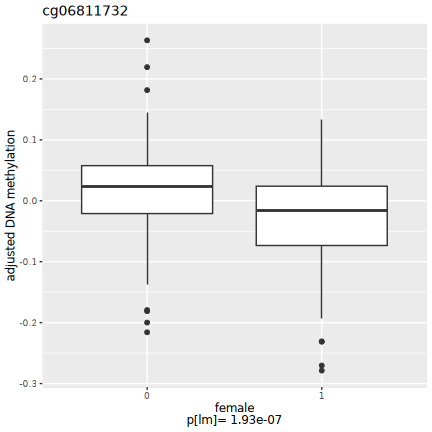

## Selected CpG sites

Number of CpG sites selected: 0.


|chromosome | position| estimate| p.value| p.adjust|
|:----------|--------:|--------:|-------:|--------:|


## R session information


```
## R version 4.4.2 (2024-10-31)
## Platform: x86_64-conda-linux-gnu
## Running under: Red Hat Enterprise Linux 8.10 (Ootpa)
## 
## Matrix products: default
## BLAS/LAPACK: /home/py16069/miniforge3/envs/r442/lib/libopenblasp-r0.3.28.so;  LAPACK version 3.12.0
## 
## locale:
##  [1] LC_CTYPE=C.UTF-8       LC_NUMERIC=C           LC_TIME=C.UTF-8       
##  [4] LC_COLLATE=C.UTF-8     LC_MONETARY=C.UTF-8    LC_MESSAGES=C.UTF-8   
##  [7] LC_PAPER=C.UTF-8       LC_NAME=C              LC_ADDRESS=C          
## [10] LC_TELEPHONE=C         LC_MEASUREMENT=C.UTF-8 LC_IDENTIFICATION=C   
## 
## time zone: Europe/London
## tzcode source: system (glibc)
## 
## attached base packages:
## [1] parallel  stats     graphics  grDevices utils     datasets  methods  
## [8] base     
## 
## other attached packages:
##  [1] gridExtra_2.3       Cairo_1.6-2         dplyr_1.1.4        
##  [4] purrr_1.0.2         ewaff_0.0.2         metafor_4.6-0      
##  [7] numDeriv_2016.8-1.1 metadat_1.2-0       Matrix_1.6-5       
## [10] mice_3.17.0         survival_3.8-3      sandwich_3.1-1     
## [13] lmtest_0.9-40       zoo_1.8-12          MASS_7.3-60.0.1    
## [16] limma_3.62.1        markdown_1.13       knitr_1.49         
## [19] SmartSVA_0.1.3      RSpectra_0.16-2     isva_1.9           
## [22] JADE_2.0-4          fastICA_1.2-7       qvalue_2.38.0      
## [25] sva_3.54.0          BiocParallel_1.40.0 genefilter_1.88.0  
## [28] mgcv_1.9-1          nlme_3.1-165        ggplot2_3.5.1      
## [31] eval.save_1.0.0    
## 
## loaded via a namespace (and not attached):
##  [1] DBI_1.2.3               rlang_1.1.4             magrittr_2.0.3         
##  [4] clue_0.3-66             matrixStats_1.5.0       compiler_4.4.2         
##  [7] RSQLite_2.3.9           png_0.1-8               vctrs_0.6.5            
## [10] reshape2_1.4.4          stringr_1.5.1           pkgconfig_2.0.3        
## [13] shape_1.4.6.1           crayon_1.5.3            fastmap_1.2.0          
## [16] backports_1.5.0         XVector_0.46.0          labeling_0.4.3         
## [19] tzdb_0.4.0              nloptr_2.1.1            UCSC.utils_1.2.0       
## [22] bit_4.5.0.1             xfun_0.52               glmnet_4.1-8           
## [25] jomo_2.7-6              zlibbioc_1.52.0         cachem_1.1.0           
## [28] GenomeInfoDb_1.42.0     jsonlite_1.8.9          blob_1.2.4             
## [31] pan_1.9                 broom_1.0.7             cluster_2.1.8          
## [34] R6_2.5.1                stringi_1.8.4           rpart_4.1.24           
## [37] boot_1.3-31             Rcpp_1.0.13-1           iterators_1.0.14       
## [40] readr_2.1.5             IRanges_2.40.0          nnet_7.3-20            
## [43] splines_4.4.2           tidyselect_1.2.1        yaml_2.3.10            
## [46] codetools_0.2-20        lattice_0.22-6          tibble_3.2.1           
## [49] plyr_1.8.9              Biobase_2.66.0          withr_3.0.2            
## [52] KEGGREST_1.46.0         evaluate_1.0.1          Biostrings_2.74.0      
## [55] pillar_1.10.1           MatrixGenerics_1.18.0   foreach_1.5.2          
## [58] stats4_4.4.2            generics_0.1.3          mathjaxr_1.6-0         
## [61] hms_1.1.3               S4Vectors_0.44.0        munsell_0.5.1          
## [64] scales_1.3.0            minqa_1.2.8             xtable_1.8-4           
## [67] glue_1.8.0              tools_4.4.2             lme4_1.1-35.5          
## [70] annotate_1.84.0         locfit_1.5-9.10         XML_3.99-0.17          
## [73] grid_4.4.2              tidyr_1.3.1             AnnotationDbi_1.68.0   
## [76] edgeR_4.4.0             colorspace_2.1-1        GenomeInfoDbData_1.2.13
## [79] meffil_1.6.0            cli_3.6.3               config_0.3.2           
## [82] gtable_0.3.6            BiocGenerics_0.52.0     farver_2.1.2           
## [85] memoise_2.0.1           lifecycle_1.0.4         httr_1.4.7             
## [88] mitml_0.4-5             statmod_1.5.0           bit64_4.5.2
```
