# Genome-wide methylation analysis report
- study: Pleural cfDNAm analysis of malignantvariable
- author: Paul Yousefi
- date: 22 September, 2026

## Parameters


```
## $sig.threshold
## [1] 2.117738e-07
## 
## $max.plots
## [1] 10
## 
## $qq.inflation.method
## [1] "median"
## 
## $practical.threshold
## [1] 8.19488e-05
```

1/2                   
2/2 [unnamed-chunk-23]


## Sample characteristics

For continuous or ordinal variables, the "mean" column provides the mean
and the "sd/%" column the standard deviation of the variable.
For categorical variables, the "mean" column provides the number
of samples with the given "value" and the
"sd/%" column the percentage of samples with the given "value".


|variable  |value |mean          |sd..      |
|:---------|:-----|:-------------|:---------|
|malignant |      |0.5570033     |0.497551  |
|sv1       |      |-6.515808e-19 |0.0571662 |
|sv2       |      |1.189797e-18  |0.0571662 |
|sv3       |      |2.307726e-18  |0.0571662 |
|sv4       |      |-1.114375e-18 |0.0571662 |
|sv5       |      |-1.269335e-18 |0.0571662 |
|sv6       |      |-8.441635e-20 |0.0571662 |
|sv7       |      |-1.415323e-18 |0.0571662 |
|sv8       |      |2.534903e-17  |0.0571662 |
|sv9       |      |2.908416e-15  |0.0571662 |
|sv10      |      |8.17379e-14   |0.0571662 |


1/4                   
2/4 [unnamed-chunk-27]
3/4                   
4/4 [unnamed-chunk-28]


## Covariate associations


### Covariate sv1


statistics


|var1      |var2 |        F|  p-value|         R|   p-value|
|:---------|:----|--------:|--------:|---------:|---------:|
|malignant |sv1  | 7.269267| 0.007404| 0.1514624| 0.0078521|


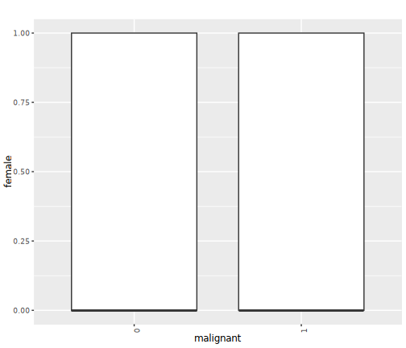


### Covariate sv2


statistics


|var1      |var2 |        F|   p-value|          R|   p-value|
|:---------|:----|--------:|---------:|----------:|---------:|
|malignant |sv2  | 1.014762| 0.3145632| -0.1026274| 0.0725603|


### Covariate sv3


statistics


|var1      |var2 |         F|   p-value|         R|   p-value|
|:---------|:----|---------:|---------:|---------:|---------:|
|malignant |sv3  | 0.0245102| 0.8756973| 0.0350724| 0.5404058|


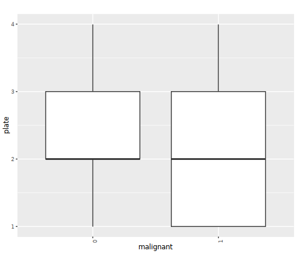


### Covariate sv4


statistics


|var1      |var2 |        F|   p-value|          R|  p-value|
|:---------|:----|--------:|---------:|----------:|--------:|
|malignant |sv4  | 0.138257| 0.7102782| -0.0068073| 0.905443|


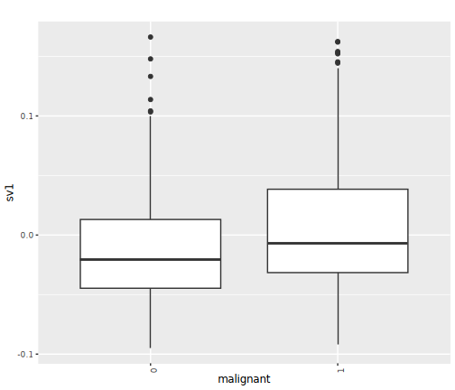


### Covariate sv5


statistics


|var1      |var2 |         F|   p-value|          R|   p-value|
|:---------|:----|---------:|---------:|----------:|---------:|
|malignant |sv5  | 0.1504286| 0.6983967| -0.0056234| 0.9218297|


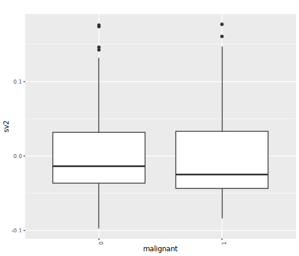


### Covariate sv6


statistics


|var1      |var2 |         F|   p-value|         R|   p-value|
|:---------|:----|---------:|---------:|---------:|---------:|
|malignant |sv6  | 0.2214356| 0.6382846| 0.0177582| 0.7566343|


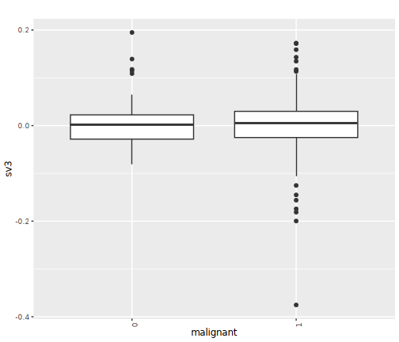


### Covariate sv7


statistics


|var1      |var2 |         F|   p-value|          R|   p-value|
|:---------|:----|---------:|---------:|----------:|---------:|
|malignant |sv7  | 0.3780687| 0.5390971| -0.0249354| 0.6634249|


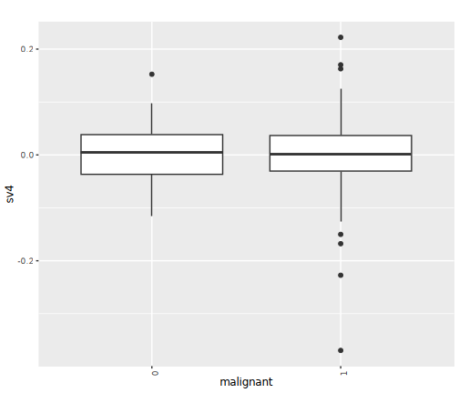


### Covariate sv8


statistics


|var1      |var2 |        F|   p-value|         R|   p-value|
|:---------|:----|--------:|---------:|---------:|---------:|
|malignant |sv8  | 3.409872| 0.0657761| 0.1222354| 0.0322712|


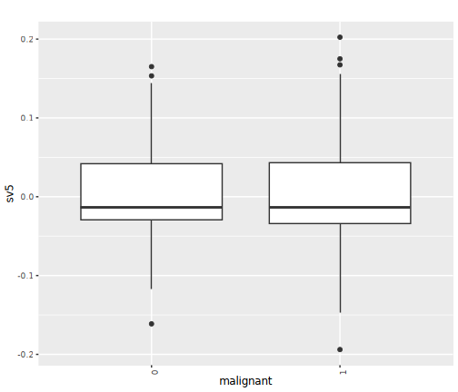


### Covariate sv9


statistics


|var1      |var2 |         F|   p-value|         R|   p-value|
|:---------|:----|---------:|---------:|---------:|---------:|
|malignant |sv9  | 0.0007275| 0.9784993| 0.0139106| 0.8081988|


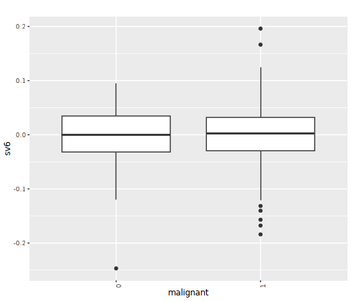


### Covariate sv10


statistics


|var1      |var2 |         F|   p-value|         R|   p-value|
|:---------|:----|---------:|---------:|---------:|---------:|
|malignant |sv10 | 0.0007804| 0.9777314| 0.0022198| 0.9691017|


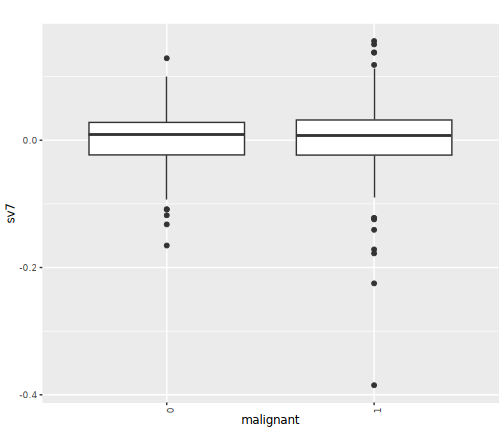


## QQ plots


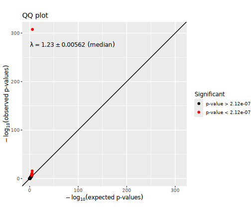

## Manhattan plots


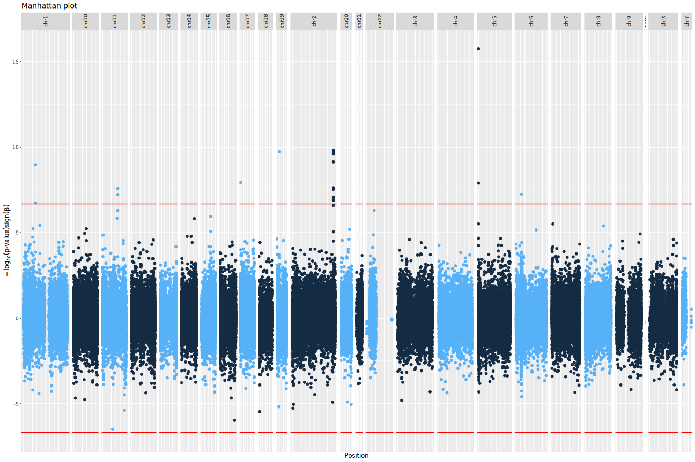

## Significant CpG sites

There were 0
CpG sites with association p-values < 2.1177377 &times; 10<sup>-7</sup>.
These are listed in the file [associations.csv](associations.csv).


Below are the 10
CpG sites with association p-values < 8.1948804 &times; 10<sup>-5</sup>
in the  regression model.


|           |chromosome |  position|   estimate|  p.value| p.adjust|
|:----------|:----------|---------:|----------:|--------:|--------:|
|cg06070414 |chr7       |  95226412| -0.0545209| 2.98e-05|        1|
|cg27358021 |chrX       |  99661597|  0.0610575| 3.81e-05|        1|
|cg00127989 |chr1       |   5998680|  0.0400421| 2.89e-05|        1|
|cg18973058 |chr13      |  88900824|  0.0210152| 7.06e-05|        1|
|cg26943453 |chrX       |  40505770|  0.0540223| 1.54e-05|        1|
|cg19136366 |chr13      | 108876272|  0.0300336| 6.33e-05|        1|
|cg07984775 |chr5       |  53656008| -0.0520476| 4.50e-05|        1|
|cg19847283 |chr19      |  20349250| -0.0448392| 6.90e-05|        1|
|cg19651219 |chr2       | 115419729| -0.0478699| 2.08e-05|        1|
|cg04549111 |chr7       |  90138040|  0.0308034| 6.09e-05|        1|

Plots of these sites follow, one for each covariate set.
"p[lm]" denotes the p-value obtained using a linear model
and "p[beta]" the p-value obtained using beta regression.


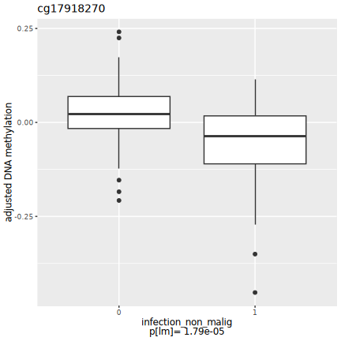


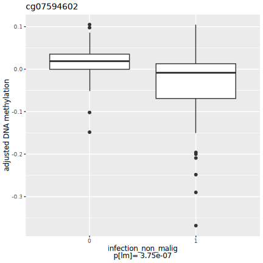


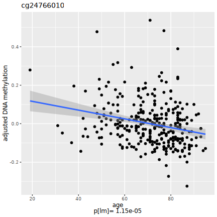


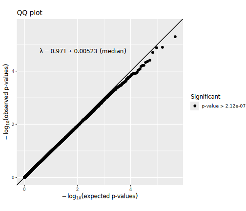


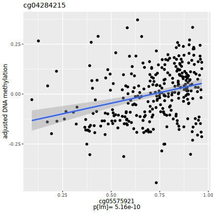


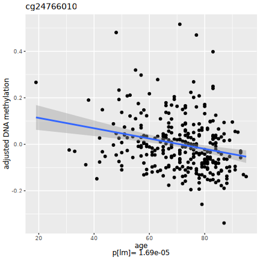


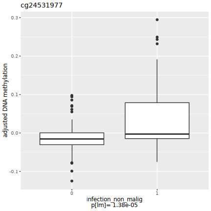


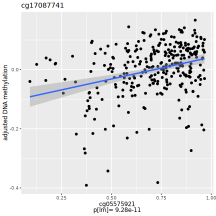


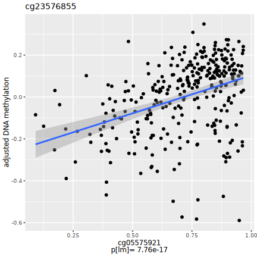


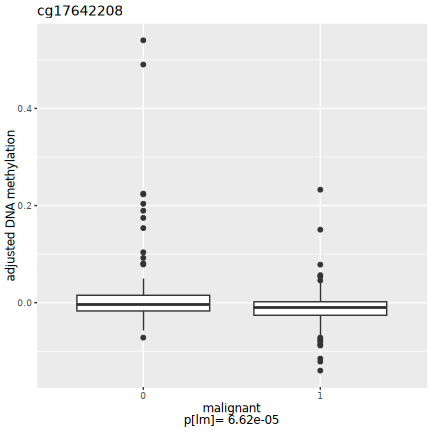

## Selected CpG sites

Number of CpG sites selected: 0.


|chromosome | position| estimate| p.value| p.adjust|
|:----------|--------:|--------:|-------:|--------:|


## R session information


```
## R version 4.4.2 (2024-10-31)
## Platform: x86_64-conda-linux-gnu
## Running under: Red Hat Enterprise Linux 8.10 (Ootpa)
## 
## Matrix products: default
## BLAS/LAPACK: /home/py16069/miniforge3/envs/r442/lib/libopenblasp-r0.3.28.so;  LAPACK version 3.12.0
## 
## locale:
##  [1] LC_CTYPE=C.UTF-8       LC_NUMERIC=C           LC_TIME=C.UTF-8       
##  [4] LC_COLLATE=C.UTF-8     LC_MONETARY=C.UTF-8    LC_MESSAGES=C.UTF-8   
##  [7] LC_PAPER=C.UTF-8       LC_NAME=C              LC_ADDRESS=C          
## [10] LC_TELEPHONE=C         LC_MEASUREMENT=C.UTF-8 LC_IDENTIFICATION=C   
## 
## time zone: Europe/London
## tzcode source: system (glibc)
## 
## attached base packages:
## [1] parallel  stats     graphics  grDevices utils     datasets  methods  
## [8] base     
## 
## other attached packages:
##  [1] gridExtra_2.3       Cairo_1.6-2         dplyr_1.1.4        
##  [4] purrr_1.0.2         ewaff_0.0.2         metafor_4.6-0      
##  [7] numDeriv_2016.8-1.1 metadat_1.2-0       Matrix_1.6-5       
## [10] mice_3.17.0         survival_3.8-3      sandwich_3.1-1     
## [13] lmtest_0.9-40       zoo_1.8-12          MASS_7.3-60.0.1    
## [16] limma_3.62.1        markdown_1.13       knitr_1.49         
## [19] SmartSVA_0.1.3      RSpectra_0.16-2     isva_1.9           
## [22] JADE_2.0-4          fastICA_1.2-7       qvalue_2.38.0      
## [25] sva_3.54.0          BiocParallel_1.40.0 genefilter_1.88.0  
## [28] mgcv_1.9-1          nlme_3.1-165        ggplot2_4.0.3      
## [31] eval.save_1.0.0    
## 
## loaded via a namespace (and not attached):
##  [1] DBI_1.2.3               rlang_1.1.4             magrittr_2.0.3         
##  [4] clue_0.3-66             matrixStats_1.5.0       compiler_4.4.2         
##  [7] RSQLite_2.3.9           png_0.1-8               vctrs_0.6.5            
## [10] reshape2_1.4.4          stringr_1.5.1           pkgconfig_2.0.3        
## [13] shape_1.4.6.1           crayon_1.5.3            fastmap_1.2.0          
## [16] backports_1.5.0         XVector_0.46.0          labeling_0.4.3         
## [19] tzdb_0.4.0              nloptr_2.1.1            UCSC.utils_1.2.0       
## [22] bit_4.5.0.1             xfun_0.52               glmnet_4.1-8           
## [25] jomo_2.7-6              zlibbioc_1.52.0         cachem_1.1.0           
## [28] GenomeInfoDb_1.42.0     jsonlite_1.8.9          blob_1.2.4             
## [31] pan_1.9                 broom_1.0.7             cluster_2.1.8          
## [34] R6_2.5.1                stringi_1.8.4           RColorBrewer_1.1-3     
## [37] rpart_4.1.24            boot_1.3-31             Rcpp_1.0.13-1          
## [40] iterators_1.0.14        readr_2.1.5             IRanges_2.40.0         
## [43] nnet_7.3-20             splines_4.4.2           tidyselect_1.2.1       
## [46] yaml_2.3.10             codetools_0.2-20        lattice_0.22-6         
## [49] tibble_3.2.1            plyr_1.8.9              Biobase_2.66.0         
## [52] withr_3.0.2             KEGGREST_1.46.0         S7_0.2.0               
## [55] evaluate_1.0.1          Biostrings_2.74.0       pillar_1.10.1          
## [58] MatrixGenerics_1.18.0   foreach_1.5.2           stats4_4.4.2           
## [61] generics_0.1.3          mathjaxr_1.6-0          hms_1.1.3              
## [64] S4Vectors_0.44.0        scales_1.4.0            minqa_1.2.8            
## [67] xtable_1.8-4            glue_1.8.0              tools_4.4.2            
## [70] lme4_1.1-35.5           annotate_1.84.0         locfit_1.5-9.10        
## [73] XML_3.99-0.17           grid_4.4.2              tidyr_1.3.1            
## [76] AnnotationDbi_1.68.0    edgeR_4.4.0             GenomeInfoDbData_1.2.13
## [79] cli_3.6.3               config_0.3.2            gtable_0.3.6           
## [82] BiocGenerics_0.52.0     farver_2.1.2            memoise_2.0.1          
## [85] lifecycle_1.0.4         httr_1.4.7              mitml_0.4-5            
## [88] statmod_1.5.0           bit64_4.5.2
```
