# Genome-wide methylation analysis report
- study: Pleural cfDNAm analysis of malignant.platevariable
- author: Paul Yousefi
- date: 19 June, 2026

## Parameters


```
## $sig.threshold
## [1] 2.119425e-07
## 
## $max.plots
## [1] 10
## 
## $qq.inflation.method
## [1] "median"
## 
## $practical.threshold
## [1] 1.968753e-05
```

1/2                   
2/2 [unnamed-chunk-23]


## Sample characteristics

For continuous or ordinal variables, the "mean" column provides the mean
and the "sd/%" column the standard deviation of the variable.
For categorical variables, the "mean" column provides the number
of samples with the given "value" and the
"sd/%" column the percentage of samples with the given "value".


|variable  |value |mean      |sd..     |
|:---------|:-----|:---------|:--------|
|malignant |      |0.5566343 |0.497588 |
|plate     |      |2.31068   |1.050935 |


1/4                   
2/4 [unnamed-chunk-27]
3/4                   
4/4 [unnamed-chunk-28]


## Covariate associations


### Covariate plate


statistics


|var1      |var2  |        F|   p-value|          R|   p-value|
|:---------|:-----|--------:|---------:|----------:|---------:|
|malignant |plate | 4.076144| 0.0443618| -0.1152038| 0.0430079|


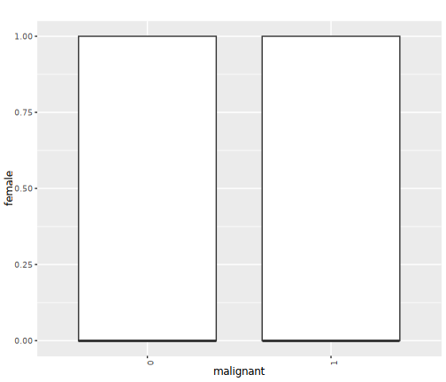


## QQ plots


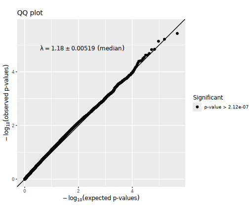

## Manhattan plots


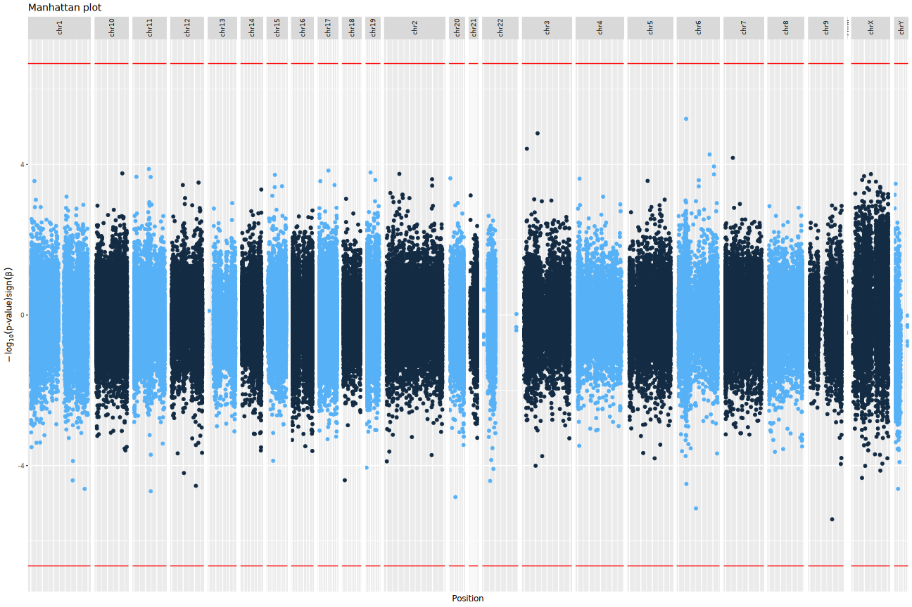

## Significant CpG sites

There were 0
CpG sites with association p-values < 2.1194254 &times; 10<sup>-7</sup>.
These are listed in the file [associations.csv](associations.csv).


Below are the 10
CpG sites with association p-values < 1.9687526 &times; 10<sup>-5</sup>
in the  regression model.


|           |chromosome |  position|   estimate|  p.value| p.adjust|
|:----------|:----------|---------:|----------:|--------:|--------:|
|cg22539917 |chr17      |  40026259| -0.0709264| 1.70e-05|        1|
|cg17978425 |chr3       |  10289658| -0.1074104| 1.79e-05|        1|
|cg03508063 |chr17      |   7124385| -0.0575444| 1.96e-05|        1|
|cg05857060 |chr7       |  75267630| -0.0786226| 1.96e-05|        1|
|cg07984775 |chr5       |  53656008| -0.0726541| 8.90e-06|        1|
|cg24469464 |chr4       |   4860157|  0.1020581| 1.42e-05|        1|
|cg22077361 |chr1       |  24195347| -0.0920321| 1.82e-05|        1|
|cg26338947 |chr12      | 127630314| -0.0938755| 1.23e-05|        1|
|cg04053959 |chr13      |  22447106| -0.0726171| 1.76e-05|        1|
|cg21351640 |chr4       |   1359728| -0.0770099| 1.27e-05|        1|

Plots of these sites follow, one for each covariate set.
"p[lm]" denotes the p-value obtained using a linear model
and "p[beta]" the p-value obtained using beta regression.


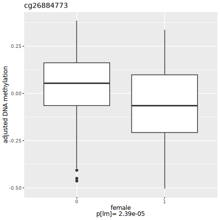


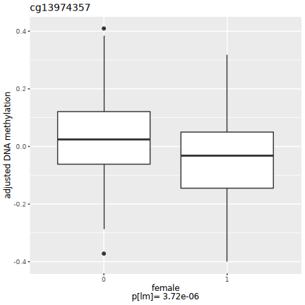


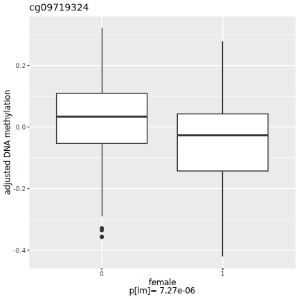


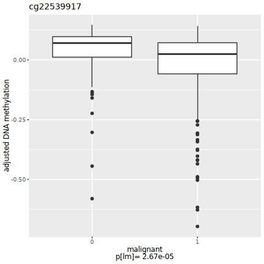


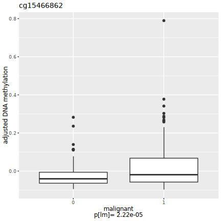


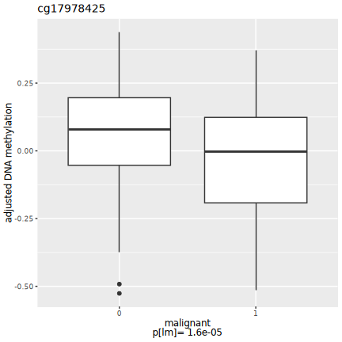


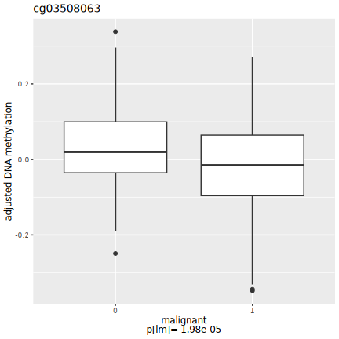


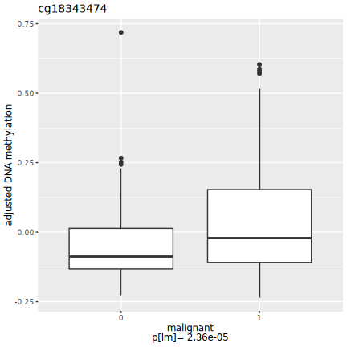


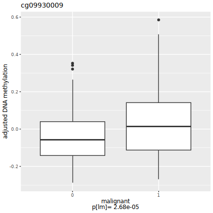


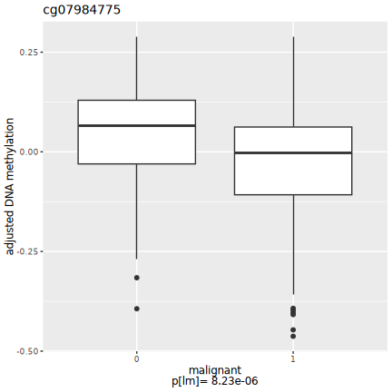

## Selected CpG sites

Number of CpG sites selected: 0.


|chromosome | position| estimate| p.value| p.adjust|
|:----------|--------:|--------:|-------:|--------:|


## R session information


```
## R version 4.4.2 (2024-10-31)
## Platform: x86_64-conda-linux-gnu
## Running under: Red Hat Enterprise Linux 8.10 (Ootpa)
## 
## Matrix products: default
## BLAS/LAPACK: /home/py16069/miniforge3/envs/r442/lib/libopenblasp-r0.3.28.so;  LAPACK version 3.12.0
## 
## locale:
##  [1] LC_CTYPE=C.UTF-8       LC_NUMERIC=C           LC_TIME=C.UTF-8       
##  [4] LC_COLLATE=C.UTF-8     LC_MONETARY=C.UTF-8    LC_MESSAGES=C.UTF-8   
##  [7] LC_PAPER=C.UTF-8       LC_NAME=C              LC_ADDRESS=C          
## [10] LC_TELEPHONE=C         LC_MEASUREMENT=C.UTF-8 LC_IDENTIFICATION=C   
## 
## time zone: Europe/London
## tzcode source: system (glibc)
## 
## attached base packages:
## [1] parallel  stats     graphics  grDevices utils     datasets  methods  
## [8] base     
## 
## other attached packages:
##  [1] gridExtra_2.3       Cairo_1.6-2         dplyr_1.1.4        
##  [4] purrr_1.0.2         ewaff_0.0.2         metafor_4.6-0      
##  [7] numDeriv_2016.8-1.1 metadat_1.2-0       Matrix_1.6-5       
## [10] mice_3.17.0         survival_3.8-3      sandwich_3.1-1     
## [13] lmtest_0.9-40       zoo_1.8-12          MASS_7.3-60.0.1    
## [16] limma_3.62.1        markdown_1.13       knitr_1.49         
## [19] SmartSVA_0.1.3      RSpectra_0.16-2     isva_1.9           
## [22] JADE_2.0-4          fastICA_1.2-7       qvalue_2.38.0      
## [25] sva_3.54.0          BiocParallel_1.40.0 genefilter_1.88.0  
## [28] mgcv_1.9-1          nlme_3.1-165        ggplot2_3.5.1      
## [31] eval.save_1.0.0    
## 
## loaded via a namespace (and not attached):
##  [1] DBI_1.2.3               rlang_1.1.4             magrittr_2.0.3         
##  [4] clue_0.3-66             matrixStats_1.5.0       compiler_4.4.2         
##  [7] RSQLite_2.3.9           png_0.1-8               vctrs_0.6.5            
## [10] reshape2_1.4.4          stringr_1.5.1           pkgconfig_2.0.3        
## [13] shape_1.4.6.1           crayon_1.5.3            fastmap_1.2.0          
## [16] backports_1.5.0         XVector_0.46.0          labeling_0.4.3         
## [19] tzdb_0.4.0              nloptr_2.1.1            UCSC.utils_1.2.0       
## [22] bit_4.5.0.1             xfun_0.52               glmnet_4.1-8           
## [25] jomo_2.7-6              zlibbioc_1.52.0         cachem_1.1.0           
## [28] GenomeInfoDb_1.42.0     jsonlite_1.8.9          blob_1.2.4             
## [31] pan_1.9                 broom_1.0.7             cluster_2.1.8          
## [34] R6_2.5.1                stringi_1.8.4           rpart_4.1.24           
## [37] boot_1.3-31             Rcpp_1.0.13-1           iterators_1.0.14       
## [40] readr_2.1.5             IRanges_2.40.0          nnet_7.3-20            
## [43] splines_4.4.2           tidyselect_1.2.1        yaml_2.3.10            
## [46] codetools_0.2-20        lattice_0.22-6          tibble_3.2.1           
## [49] plyr_1.8.9              Biobase_2.66.0          withr_3.0.2            
## [52] KEGGREST_1.46.0         evaluate_1.0.1          Biostrings_2.74.0      
## [55] pillar_1.10.1           MatrixGenerics_1.18.0   foreach_1.5.2          
## [58] stats4_4.4.2            generics_0.1.3          mathjaxr_1.6-0         
## [61] hms_1.1.3               S4Vectors_0.44.0        commonmark_1.9.5       
## [64] munsell_0.5.1           scales_1.3.0            minqa_1.2.8            
## [67] xtable_1.8-4            glue_1.8.0              tools_4.4.2            
## [70] lme4_1.1-35.5           annotate_1.84.0         locfit_1.5-9.10        
## [73] XML_3.99-0.17           grid_4.4.2              tidyr_1.3.1            
## [76] AnnotationDbi_1.68.0    edgeR_4.4.0             colorspace_2.1-1       
## [79] GenomeInfoDbData_1.2.13 cli_3.6.3               config_0.3.2           
## [82] gtable_0.3.6            BiocGenerics_0.52.0     farver_2.1.2           
## [85] memoise_2.0.1           lifecycle_1.0.4         httr_1.4.7             
## [88] mime_0.12               mitml_0.4-5             statmod_1.5.0          
## [91] bit64_4.5.2
```
